# Mystic Tarot Application Architecture

> **Last Verified**: 2026-01-09
> **Verification Notes**: Comprehensive codebase review completed. See discrepancies section below.


---

## Security Architecture

### Trust Zones & Boundaries

```mermaid
graph TB
    subgraph untrusted["🔴 Untrusted Zone (Internet)"]
        browser["Browser Client"]
        external_bots["Social Media Crawlers"]
    end

    subgraph edge["🟡 Edge Zone (Cloudflare)"]
        cf_ddos["DDoS Protection"]
        cf_waf["Web Application Firewall"]
        cf_assets_cdn["Assets CDN"]
    end

    subgraph worker_zone["🟢 Worker Zone (Cloudflare Workers)"]
        worker_entry["Worker Entry Point<br>src/worker/index.js"]
        cors_handler["CORS Handler<br>handleOptions() / addCorsHeaders()"]
        route_matcher["Route Matcher<br>matchRoute()"]
        
        subgraph auth_layer["Authentication Layer"]
            session_auth["Session Auth<br>validateSession()"]
            api_key_auth["API Key Auth<br>validateApiKey()"]
            cookie_parser["Cookie Parser<br>getSessionFromCookie()"]
        end
        
        subgraph rate_limit_layer["Rate Limiting Layer"]
            usage_tracking["Usage Tracking<br>usageTracking.js"]
            tier_limits["Tier-Based Limits<br>entitlements.js"]
            kv_ratelimit["KV Rate Store<br>RATELIMIT binding"]
        end
        
        subgraph safety_layer["Safety & Evaluation Layer"]
            crisis_detection["Crisis Detection<br>safetyChecks.js"]
            eval_gate["Evaluation Gate<br>evaluation.js"]
            pii_redaction["PII Redaction<br>promptEngineering.js"]
        end
        
        api_handlers["API Handlers<br>functions/api/"]
    end

    subgraph storage_zone["🔵 Storage Zone (Cloudflare)"]
        d1_db["D1 Database<br>Users, Sessions, Journals"]
        kv_metrics["KV: METRICS_DB"]
        kv_feedback["KV: FEEDBACK_KV"]
        r2_logs["R2: LOGS_BUCKET"]
    end

    subgraph ai_zone["🟣 AI Zone (External Services)"]
        azure_openai["Azure OpenAI<br>GPT-5 / TTS"]
        azure_anthropic["Azure Anthropic<br>Claude Fallback"]
        cf_workers_ai["Workers AI<br>Evaluation"]
    end

    browser --> cf_ddos
    external_bots --> cf_ddos
    cf_ddos --> cf_waf
    cf_waf --> cf_assets_cdn
    cf_waf --> worker_entry

    worker_entry --> cors_handler
    cors_handler --> route_matcher
    route_matcher --> auth_layer
    auth_layer --> rate_limit_layer
    rate_limit_layer --> safety_layer
    safety_layer --> api_handlers

    api_handlers --> storage_zone
    api_handlers --> ai_zone
    
    auth_layer --> d1_db
    rate_limit_layer --> kv_ratelimit
```



### Authentication Flow


### Security Features by Layer

| Layer | Feature | Implementation |
|-------|---------|----------------|
| **Password Storage** | PBKDF2 (100k iterations) | [`functions/lib/auth.js:hashPassword()`](functions/lib/auth.js:26) |
| **Session Management** | HTTP-only SameSite cookies, 30-day expiry | [`functions/lib/auth.js:createSessionCookie()`](functions/lib/auth.js:289) |
| **API Keys** | SHA-256 hashed, `sk_` prefix | [`functions/lib/apiKeys.js:hashApiKey()`](functions/lib/apiKeys.js:25) |
| **CORS** | Origin echo, credentialed support | [`src/worker/index.js:handleOptions()`](src/worker/index.js:268) |
| **Rate Limiting** | Tier-based (guest: 20, user: 100, API: 1000) | [`functions/lib/usageTracking.js`](functions/lib/usageTracking.js:1) |
| **Crisis Detection** | Regex-based self-harm/medical patterns | [`functions/lib/safetyChecks.js:detectCrisisSignals()`](functions/lib/safetyChecks.js:66) |
| **Content Evaluation** | Workers AI safety scoring | [`functions/lib/evaluation.js:runSyncEvaluationGate()`](functions/lib/evaluation.js:715) |
| **PII Redaction** | Email, phone, SSN, dates, names | [`functions/lib/evaluation.js:redactUserQuestion()`](functions/lib/evaluation.js:33) |
| **Timing-Safe Comparison** | Constant-time password/key verification | [`functions/lib/crypto.js:timingSafeEqual()`](functions/lib/crypto.js:1) |

---

## Data Flow Architecture

### Reading Request Lifecycle


### Subscription & Entitlement Flow


### Metrics & Evaluation Pipeline


---

## Rate Limiting Strategy

### Tier-Based Limits

| Tier | Monthly Readings | TTS Requests | API Calls | Spreads Available |
|------|-----------------|--------------|-----------|-------------------|
| **Free** | 5 | 10 | 0 | Single, Three-Card, Five-Card |
| **Plus** | 50 | 100 | 0 | All standard spreads |
| **Pro** | Unlimited | 500 | 1000/month | All + custom spreads |

### Implementation Details

```
Storage Hierarchy:
1. Authenticated users → D1 usage_tracking table (per user/month)
2. Anonymous users → KV RATELIMIT (per IP/month)
3. Global rate limits → KV with TTL

Key Format:
- readings-monthly:{clientId}:{YYYY-MM}
- tts-monthly:{userId}:{YYYY-MM}
- api-calls:{userId}:{YYYY-MM}

Reservation Pattern:
- Pre-increment counter before expensive operations
- Release on failure via releaseReadingReservation()
- Prevents usage leaks on errors
```

---

## Verification Summary

### ✅ Verified Correct Components

| Component | Location | Status |
|-----------|----------|--------|
| React + Vite Frontend | `src/main.jsx` | ✅ Correct |
| Worker Entry Point | `src/worker/index.js` | ✅ Correct |
| D1 Database (DB) | `wrangler.jsonc` | ✅ Correct |
| KV Namespaces (3) | `wrangler.jsonc` | ✅ Correct |
| Workers AI | `wrangler.jsonc` | ✅ Correct |
| Assets Binding | `wrangler.jsonc` | ✅ Correct |
| Scheduled Handler | `functions/lib/scheduled.js` | ✅ Correct |
| Azure OpenAI GPT-5 | `functions/api/tarot-reading.js` | ✅ Correct |
| Azure Anthropic Claude | `functions/api/tarot-reading.js` | ✅ Correct |
| Share OG Injector | `src/worker/index.js` | ✅ Correct |

### ⚠️ Discrepancies Found

| Original Diagram | Actual Implementation | Impact |
|-----------------|----------------------|--------|
| "External Email Service" | **Resend API** (`RESEND_API_KEY`) | Rename needed |
| Generic "Context Providers" | **5 specific providers**: Auth, Subscription, Preferences, Reading, Toast | Add detail |
| Generic "Page Components" | **7 specific pages**: Home, Account, Admin, Gallery, Pricing, Share, Journal | Add detail |
| "Azure TTS" (single) | **Two TTS systems**: Azure OpenAI gpt-4o-mini-tts + Hume AI | Split node |
| Missing | **Stripe Integration**: checkout, portal, webhooks | Add nodes |
| Missing | **Auth System**: login, logout, register, me | Add nodes |
| Missing | **Journal System**: CRUD, export, patterns | Add nodes |
| Missing | **Archetype Journey**: tracking, backfill | Add nodes |
| Missing | **Hume AI TTS**: `functions/api/tts-hume.js` | Add node |
| Missing | **Ephemeris Server**: astrological context | Add node |
| Missing | **GraphRAG System**: knowledge graph retrieval | Add to lib |
| Missing | **Quality Analysis**: regression detection | Add to lib |

### 📦 Complete API Endpoint Inventory

```
functions/api/
├── archetype-journey.js
├── archetype-journey/
│   ├── [[path]].js
│   └── card-frequency.js
├── archetype-journey-backfill.js
├── auth/
│   ├── login.js
│   ├── logout.js
│   ├── me.js
│   └── register.js
├── admin/
│   └── quality-stats.js
├── coach-extraction-backfill.js
├── create-checkout-session.js
├── create-portal-session.js
├── feedback.js
├── generate-question.js
├── journal.js
├── journal/
│   ├── [id].js
│   └── pattern-alerts.js
├── journal-export.js
├── share.js
├── share/[token].js
├── share-notes/[token].js
├── speech-token.js
├── tarot-reading.js
├── tts.js
├── tts-hume.js
├── usage.js
└── webhooks/
    └── stripe.js
```

### 🔧 Environment Secrets Required

| Secret | Service | Used By |
|--------|---------|---------|
| `AZURE_OPENAI_API_KEY` | Azure OpenAI | tarot-reading.js |
| `AZURE_OPENAI_ENDPOINT` | Azure OpenAI | tarot-reading.js |
| `AZURE_OPENAI_GPT5_MODEL` | Azure OpenAI | tarot-reading.js |
| `AZURE_ANTHROPIC_API_KEY` | Azure AI Foundry | tarot-reading.js |
| `AZURE_ANTHROPIC_ENDPOINT` | Azure AI Foundry | tarot-reading.js |
| `AZURE_OPENAI_TTS_API_KEY` | Azure OpenAI TTS | tts.js |
| `AZURE_OPENAI_TTS_ENDPOINT` | Azure OpenAI TTS | tts.js |
| `AZURE_SPEECH_KEY` | Azure Cognitive Services | speech-token.js |
| `AZURE_SPEECH_REGION` | Azure Cognitive Services | speech-token.js |
| `RESEND_API_KEY` | Resend Email | emailService.js |
| `STRIPE_SECRET_KEY` | Stripe | webhooks/stripe.js |
| `STRIPE_WEBHOOK_SECRET` | Stripe | webhooks/stripe.js |
| `HUME_API_KEY` | Hume AI | tts-hume.js |
| `VISION_PROOF_SECRET` | Vision validation | tarot-reading.js |
| `ADMIN_API_KEY` | Admin endpoints | scheduled.js |

### 📊 Cron Schedule

| Schedule | Task | Handler |
|----------|------|---------|
| `0 3 * * *` (Daily 3 AM UTC) | Archive metrics/feedback KV→D1, cleanup sessions, quality analysis | `handleScheduled()` |
*Generated by [CodeViz.ai](https://codeviz.ai) on 1/9/2026, 7:31:12 AM*
