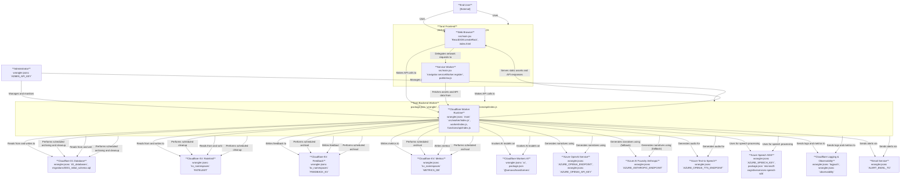

# Unnamed CodeViz Diagram

```mermaid
graph TD

    base.cv::user["**End User**<br>[External]"]
    base.cv::d1_db["**Cloudflare D1 Database**<br>wrangler.jsonc `d1_databases`, migrations/0001_initial_schema.sql"]
    base.cv::kv_ratelimit["**Cloudflare KV: Ratelimit**<br>wrangler.jsonc `kv_namespaces` `RATELIMIT`"]
    base.cv::kv_feedback["**Cloudflare KV: Feedback**<br>wrangler.jsonc `kv_namespaces` `FEEDBACK_KV`"]
    base.cv::kv_metrics["**Cloudflare KV: Metrics**<br>wrangler.jsonc `kv_namespaces` `METRICS_DB`"]
    base.cv::cloudflare_ai["**Cloudflare Workers AI**<br>wrangler.jsonc `ai`, package.json `@xenova/transformers`"]
    base.cv::azure_openai["**Azure OpenAI Service**<br>wrangler.jsonc `AZURE_OPENAI_ENDPOINT`, wrangler.jsonc `AZURE_OPENAI_API_KEY`"]
    base.cv::azure_anthropic["**Azure AI Foundry Anthropic**<br>wrangler.jsonc `AZURE_ANTHROPIC_ENDPOINT`"]
    base.cv::azure_tts["**Azure Text-to-Speech**<br>wrangler.jsonc `AZURE_OPENAI_TTS_ENDPOINT`"]
    base.cv::azure_speech_sdk["**Azure Speech SDK**<br>wrangler.jsonc `AZURE_SPEECH_KEY`, package.json `microsoft-cognitiveservices-speech-sdk`"]
    base.cv::admin["**Administrator**<br>wrangler.jsonc `ADMIN_API_KEY`"]
    base.cv::cloudflare_log_obs["**Cloudflare Logging & Observability**<br>wrangler.jsonc `logpush`, wrangler.jsonc `observability`"]
    base.cv::email_service["**Email Service**<br>wrangler.jsonc `ALERT_EMAIL_TO`"]
    subgraph base.cv::frontend_app["**Tarot Frontend**<br>package.json `react`, vite.config.js, src/main.jsx"]
        base.cv::web_browser["**Web Browser**<br>src/main.jsx `ReactDOM.createRoot`, index.html"]
        base.cv::service_worker["**Service Worker**<br>src/main.jsx `navigator.serviceWorker.register`, public/sw.js"]
        %% Edges at this level (grouped by source)
        base.cv::web_browser["**Web Browser**<br>src/main.jsx `ReactDOM.createRoot`, index.html"] -->|"Delegates network requests to"| base.cv::service_worker["**Service Worker**<br>src/main.jsx `navigator.serviceWorker.register`, public/sw.js"]
    end
    subgraph base.cv::cloudflare_worker["**Tarot Backend Worker**<br>package.json `wrangler`, wrangler.jsonc, .worker/index.js, functions/api/index.js"]
        base.cv::worker_runtime["**Cloudflare Worker Runtime**<br>wrangler.jsonc `main` `.src/worker/index.js`, .worker/index.js, functions/api/index.js"]
    end
    %% Edges at this level (grouped by source)
    base.cv::user["**End User**<br>[External]"] -->|"Uses"| base.cv::frontend_app["**Tarot Frontend**<br>package.json `react`, vite.config.js, src/main.jsx"]
    base.cv::user["**End User**<br>[External]"] -->|"Uses"| base.cv::web_browser["**Web Browser**<br>src/main.jsx `ReactDOM.createRoot`, index.html"]
    base.cv::frontend_app["**Tarot Frontend**<br>package.json `react`, vite.config.js, src/main.jsx"] -->|"Makes API calls to"| base.cv::cloudflare_worker["**Tarot Backend Worker**<br>package.json `wrangler`, wrangler.jsonc, .worker/index.js, functions/api/index.js"]
    base.cv::cloudflare_worker["**Tarot Backend Worker**<br>package.json `wrangler`, wrangler.jsonc, .worker/index.js, functions/api/index.js"] -->|"Reads from and writes to"| base.cv::d1_db["**Cloudflare D1 Database**<br>wrangler.jsonc `d1_databases`, migrations/0001_initial_schema.sql"]
    base.cv::cloudflare_worker["**Tarot Backend Worker**<br>package.json `wrangler`, wrangler.jsonc, .worker/index.js, functions/api/index.js"] -->|"Reads from and writes to"| base.cv::kv_ratelimit["**Cloudflare KV: Ratelimit**<br>wrangler.jsonc `kv_namespaces` `RATELIMIT`"]
    base.cv::cloudflare_worker["**Tarot Backend Worker**<br>package.json `wrangler`, wrangler.jsonc, .worker/index.js, functions/api/index.js"] -->|"Writes feedback to"| base.cv::kv_feedback["**Cloudflare KV: Feedback**<br>wrangler.jsonc `kv_namespaces` `FEEDBACK_KV`"]
    base.cv::cloudflare_worker["**Tarot Backend Worker**<br>package.json `wrangler`, wrangler.jsonc, .worker/index.js, functions/api/index.js"] -->|"Writes metrics to"| base.cv::kv_metrics["**Cloudflare KV: Metrics**<br>wrangler.jsonc `kv_namespaces` `METRICS_DB`"]
    base.cv::cloudflare_worker["**Tarot Backend Worker**<br>package.json `wrangler`, wrangler.jsonc, .worker/index.js, functions/api/index.js"] -->|"Invokes AI models on"| base.cv::cloudflare_ai["**Cloudflare Workers AI**<br>wrangler.jsonc `ai`, package.json `@xenova/transformers`"]
    base.cv::cloudflare_worker["**Tarot Backend Worker**<br>package.json `wrangler`, wrangler.jsonc, .worker/index.js, functions/api/index.js"] -->|"Generates narratives using"| base.cv::azure_openai["**Azure OpenAI Service**<br>wrangler.jsonc `AZURE_OPENAI_ENDPOINT`, wrangler.jsonc `AZURE_OPENAI_API_KEY`"]
    base.cv::cloudflare_worker["**Tarot Backend Worker**<br>package.json `wrangler`, wrangler.jsonc, .worker/index.js, functions/api/index.js"] -->|"Generates narratives using (fallback)"| base.cv::azure_anthropic["**Azure AI Foundry Anthropic**<br>wrangler.jsonc `AZURE_ANTHROPIC_ENDPOINT`"]
    base.cv::cloudflare_worker["**Tarot Backend Worker**<br>package.json `wrangler`, wrangler.jsonc, .worker/index.js, functions/api/index.js"] -->|"Generates audio for"| base.cv::azure_tts["**Azure Text-to-Speech**<br>wrangler.jsonc `AZURE_OPENAI_TTS_ENDPOINT`"]
    base.cv::cloudflare_worker["**Tarot Backend Worker**<br>package.json `wrangler`, wrangler.jsonc, .worker/index.js, functions/api/index.js"] -->|"Uses for speech processing"| base.cv::azure_speech_sdk["**Azure Speech SDK**<br>wrangler.jsonc `AZURE_SPEECH_KEY`, package.json `microsoft-cognitiveservices-speech-sdk`"]
    base.cv::cloudflare_worker["**Tarot Backend Worker**<br>package.json `wrangler`, wrangler.jsonc, .worker/index.js, functions/api/index.js"] -->|"Performs scheduled archiving and cleanup"| base.cv::d1_db["**Cloudflare D1 Database**<br>wrangler.jsonc `d1_databases`, migrations/0001_initial_schema.sql"]
    base.cv::cloudflare_worker["**Tarot Backend Worker**<br>package.json `wrangler`, wrangler.jsonc, .worker/index.js, functions/api/index.js"] -->|"Performs scheduled cleanup"| base.cv::kv_ratelimit["**Cloudflare KV: Ratelimit**<br>wrangler.jsonc `kv_namespaces` `RATELIMIT`"]
    base.cv::cloudflare_worker["**Tarot Backend Worker**<br>package.json `wrangler`, wrangler.jsonc, .worker/index.js, functions/api/index.js"] -->|"Performs scheduled archival"| base.cv::kv_feedback["**Cloudflare KV: Feedback**<br>wrangler.jsonc `kv_namespaces` `FEEDBACK_KV`"]
    base.cv::cloudflare_worker["**Tarot Backend Worker**<br>package.json `wrangler`, wrangler.jsonc, .worker/index.js, functions/api/index.js"] -->|"Performs scheduled archival"| base.cv::kv_metrics["**Cloudflare KV: Metrics**<br>wrangler.jsonc `kv_namespaces` `METRICS_DB`"]
    base.cv::cloudflare_worker["**Tarot Backend Worker**<br>package.json `wrangler`, wrangler.jsonc, .worker/index.js, functions/api/index.js"] -->|"Sends logs and metrics to"| base.cv::cloudflare_log_obs["**Cloudflare Logging & Observability**<br>wrangler.jsonc `logpush`, wrangler.jsonc `observability`"]
    base.cv::cloudflare_worker["**Tarot Backend Worker**<br>package.json `wrangler`, wrangler.jsonc, .worker/index.js, functions/api/index.js"] -->|"Sends alerts via"| base.cv::email_service["**Email Service**<br>wrangler.jsonc `ALERT_EMAIL_TO`"]
    base.cv::admin["**Administrator**<br>wrangler.jsonc `ADMIN_API_KEY`"] -->|"Manages and monitors"| base.cv::cloudflare_worker["**Tarot Backend Worker**<br>package.json `wrangler`, wrangler.jsonc, .worker/index.js, functions/api/index.js"]
    base.cv::admin["**Administrator**<br>wrangler.jsonc `ADMIN_API_KEY`"] -->|"Manages and monitors"| base.cv::worker_runtime["**Cloudflare Worker Runtime**<br>wrangler.jsonc `main` `.src/worker/index.js`, .worker/index.js, functions/api/index.js"]
    base.cv::web_browser["**Web Browser**<br>src/main.jsx `ReactDOM.createRoot`, index.html"] -->|"Makes API calls to"| base.cv::worker_runtime["**Cloudflare Worker Runtime**<br>wrangler.jsonc `main` `.src/worker/index.js`, .worker/index.js, functions/api/index.js"]
    base.cv::service_worker["**Service Worker**<br>src/main.jsx `navigator.serviceWorker.register`, public/sw.js"] -->|"Fetches assets and API data from"| base.cv::worker_runtime["**Cloudflare Worker Runtime**<br>wrangler.jsonc `main` `.src/worker/index.js`, .worker/index.js, functions/api/index.js"]
    base.cv::worker_runtime["**Cloudflare Worker Runtime**<br>wrangler.jsonc `main` `.src/worker/index.js`, .worker/index.js, functions/api/index.js"] -->|"Reads from and writes to"| base.cv::d1_db["**Cloudflare D1 Database**<br>wrangler.jsonc `d1_databases`, migrations/0001_initial_schema.sql"]
    base.cv::worker_runtime["**Cloudflare Worker Runtime**<br>wrangler.jsonc `main` `.src/worker/index.js`, .worker/index.js, functions/api/index.js"] -->|"Reads from and writes to"| base.cv::kv_ratelimit["**Cloudflare KV: Ratelimit**<br>wrangler.jsonc `kv_namespaces` `RATELIMIT`"]
    base.cv::worker_runtime["**Cloudflare Worker Runtime**<br>wrangler.jsonc `main` `.src/worker/index.js`, .worker/index.js, functions/api/index.js"] -->|"Writes feedback to"| base.cv::kv_feedback["**Cloudflare KV: Feedback**<br>wrangler.jsonc `kv_namespaces` `FEEDBACK_KV`"]
    base.cv::worker_runtime["**Cloudflare Worker Runtime**<br>wrangler.jsonc `main` `.src/worker/index.js`, .worker/index.js, functions/api/index.js"] -->|"Writes metrics to"| base.cv::kv_metrics["**Cloudflare KV: Metrics**<br>wrangler.jsonc `kv_namespaces` `METRICS_DB`"]
    base.cv::worker_runtime["**Cloudflare Worker Runtime**<br>wrangler.jsonc `main` `.src/worker/index.js`, .worker/index.js, functions/api/index.js"] -->|"Invokes AI models on"| base.cv::cloudflare_ai["**Cloudflare Workers AI**<br>wrangler.jsonc `ai`, package.json `@xenova/transformers`"]
    base.cv::worker_runtime["**Cloudflare Worker Runtime**<br>wrangler.jsonc `main` `.src/worker/index.js`, .worker/index.js, functions/api/index.js"] -->|"Generates narratives using"| base.cv::azure_openai["**Azure OpenAI Service**<br>wrangler.jsonc `AZURE_OPENAI_ENDPOINT`, wrangler.jsonc `AZURE_OPENAI_API_KEY`"]
    base.cv::worker_runtime["**Cloudflare Worker Runtime**<br>wrangler.jsonc `main` `.src/worker/index.js`, .worker/index.js, functions/api/index.js"] -->|"Generates narratives using (fallback)"| base.cv::azure_anthropic["**Azure AI Foundry Anthropic**<br>wrangler.jsonc `AZURE_ANTHROPIC_ENDPOINT`"]
    base.cv::worker_runtime["**Cloudflare Worker Runtime**<br>wrangler.jsonc `main` `.src/worker/index.js`, .worker/index.js, functions/api/index.js"] -->|"Generates audio for"| base.cv::azure_tts["**Azure Text-to-Speech**<br>wrangler.jsonc `AZURE_OPENAI_TTS_ENDPOINT`"]
    base.cv::worker_runtime["**Cloudflare Worker Runtime**<br>wrangler.jsonc `main` `.src/worker/index.js`, .worker/index.js, functions/api/index.js"] -->|"Uses for speech processing"| base.cv::azure_speech_sdk["**Azure Speech SDK**<br>wrangler.jsonc `AZURE_SPEECH_KEY`, package.json `microsoft-cognitiveservices-speech-sdk`"]
    base.cv::worker_runtime["**Cloudflare Worker Runtime**<br>wrangler.jsonc `main` `.src/worker/index.js`, .worker/index.js, functions/api/index.js"] -->|"Performs scheduled archiving and cleanup"| base.cv::d1_db["**Cloudflare D1 Database**<br>wrangler.jsonc `d1_databases`, migrations/0001_initial_schema.sql"]
    base.cv::worker_runtime["**Cloudflare Worker Runtime**<br>wrangler.jsonc `main` `.src/worker/index.js`, .worker/index.js, functions/api/index.js"] -->|"Performs scheduled cleanup"| base.cv::kv_ratelimit["**Cloudflare KV: Ratelimit**<br>wrangler.jsonc `kv_namespaces` `RATELIMIT`"]
    base.cv::worker_runtime["**Cloudflare Worker Runtime**<br>wrangler.jsonc `main` `.src/worker/index.js`, .worker/index.js, functions/api/index.js"] -->|"Performs scheduled archival"| base.cv::kv_feedback["**Cloudflare KV: Feedback**<br>wrangler.jsonc `kv_namespaces` `FEEDBACK_KV`"]
    base.cv::worker_runtime["**Cloudflare Worker Runtime**<br>wrangler.jsonc `main` `.src/worker/index.js`, .worker/index.js, functions/api/index.js"] -->|"Performs scheduled archival"| base.cv::kv_metrics["**Cloudflare KV: Metrics**<br>wrangler.jsonc `kv_namespaces` `METRICS_DB`"]
    base.cv::worker_runtime["**Cloudflare Worker Runtime**<br>wrangler.jsonc `main` `.src/worker/index.js`, .worker/index.js, functions/api/index.js"] -->|"Sends logs and metrics to"| base.cv::cloudflare_log_obs["**Cloudflare Logging & Observability**<br>wrangler.jsonc `logpush`, wrangler.jsonc `observability`"]
    base.cv::worker_runtime["**Cloudflare Worker Runtime**<br>wrangler.jsonc `main` `.src/worker/index.js`, .worker/index.js, functions/api/index.js"] -->|"Sends alerts via"| base.cv::email_service["**Email Service**<br>wrangler.jsonc `ALERT_EMAIL_TO`"]
    base.cv::worker_runtime["**Cloudflare Worker Runtime**<br>wrangler.jsonc `main` `.src/worker/index.js`, .worker/index.js, functions/api/index.js"] -->|"Serves static assets and API responses"| base.cv::web_browser["**Web Browser**<br>src/main.jsx `ReactDOM.createRoot`, index.html"]

```
---
*Generated by [CodeViz.ai](https://codeviz.ai) on 1/14/2026, 3:19:18 PM*
