# Full System Diagrams

Type: reference
Status: active reference
Last reviewed: 2026-09-25

This document contains comprehensive Mermaid diagrams covering the current application architecture.

These diagrams are maintained as high-level references, not exact schema dumps. Validate route ownership, bindings, and database fields against `src/worker/index.js`, `wrangler.jsonc`, `functions/`, and `migrations/` when making implementation changes.

## 1. High-Level System Architecture

```mermaid
graph TB
    subgraph External["External Services"]
        ModalQwen["Modal Qwen<br/>Chat Completions"]
        OpenAI["OpenAI native Responses<br/>azure-gpt5"]
        AzureOpenAI["Azure OpenAI Responses<br/>azure-gpt5 fallback"]
        Claude["Azure AI Foundry<br/>Claude Opus 4.5"]
        AzureTTS["Azure OpenAI<br/>Text-to-Speech"]
        AzureSpeech["Azure Speech<br/>Client Tokens"]
        HumeAI["Hume AI<br/>Alternative TTS"]
        Stripe["Stripe<br/>Checkout, Portal, Webhooks"]
        EmailService["Email Service<br/>Quality Alerts"]
        Sentry["Sentry<br/>Errors and sampled replay"]
    end

    subgraph Cloudflare["Cloudflare Infrastructure"]
        Worker["Cloudflare Worker<br/>src/worker/index.js"]
        ReadingJob["READING_JOBS Durable Object<br/>ReadingJob"]
        WorkersAI["Workers AI<br/>Qwen evaluation; optional Llama vision"]
        D1["D1 (DB)<br/>App data, eval_metrics, quality, usage, media metadata"]
        KV_Rate["KV RATELIMIT<br/>Rate limiting"]
        KV_Feedback["KV FEEDBACK_KV<br/>Feedback cache"]
        KV_Metrics["KV METRICS_DB<br/>Media telemetry, media usage, card-video job metadata,<br/>ongoing compatibility archive input"]
        R2["R2 (R2_LOGS)<br/>Generated/user media, journal exports, archives"]
        Assets["ASSETS binding<br/>Static files"]
        Logpush["Logpush and observability"]
        CronVideo["Cron */10 * * * *<br/>Card-video usage reconciliation"]
        CronDaily["Cron 0 3 * * *<br/>Quality analysis, ongoing KV compatibility archival, cleanup"]
    end

    subgraph App["Tarot Application"]
        Frontend["Frontend<br/>React + Vite"]
        Shared["Shared<br/>Isomorphic modules"]
        LocalComposer["Local composer<br/>Deterministic fallback"]
    end

    Frontend <-->|"API calls and SSE"| Worker
    Worker --> WorkersAI
    Worker --> D1
    Worker --> KV_Rate
    Worker --> KV_Feedback
    Worker --> KV_Metrics
    Worker --> R2
    Worker --> Assets
    Worker --> Logpush
    Worker -->|"/api/tarot-reading/jobs/*"| ReadingJob
    Worker -->|1. narrative| ModalQwen
    Worker -->|2. azure-gpt5: native| OpenAI
    Worker -->|2. azure-gpt5: Azure fallback| AzureOpenAI
    Worker -->|3. fallback| Claude
    Worker -->|4. deterministic fallback| LocalComposer
    Worker -->|TTS| AzureTTS
    Worker -->|TTS alternative| HumeAI
    Worker -->|Payments| Stripe
    Worker -->|Alerts| EmailService
    Worker -->|Diagnostics and replay| Sentry
    Frontend --> AzureSpeech
    Worker --> CronVideo
    Worker --> CronDaily
    CronVideo --> KV_Metrics
    CronDaily --> D1
    CronDaily --> KV_Metrics
    Shared -.->|"Used by"| Frontend
    Shared -.->|"Used by"| Worker
```

## 2. Frontend Application Architecture

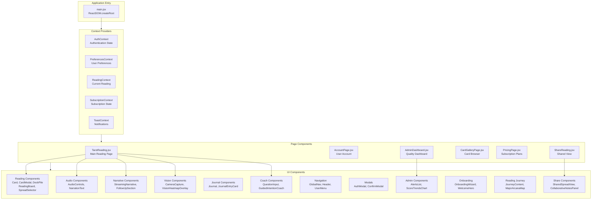

## 3. Frontend Hooks & Libraries

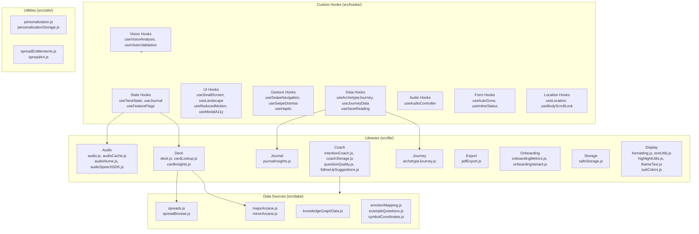

## 4. Worker API Architecture

```mermaid
graph TB
    subgraph Router["Worker Router<br>src/worker/index.js"]
        Fetch["fetch() handler"]
        CronVideo["scheduled(): */10 * * * *<br/>card-video usage reconciliation"]
        CronDaily["scheduled(): 0 3 * * *<br/>quality, compatibility archival, cleanup"]
        ShareOG["Share page OG injector"]
    end

    subgraph CoreAPIs["Core Reading APIs"]
        TarotAPI["POST /api/tarot-reading<br/>Main reading generation"]
        TarotDraw["POST /api/tarot-reading/draw<br/>Seeded draw"]
        TarotJobsStart["POST /api/tarot-reading/jobs<br/>Start job"]
        TarotJobsStream["GET /api/tarot-reading/jobs/:id/stream<br/>SSE stream"]
        TarotJobsCancel["POST /api/tarot-reading/jobs/:id/cancel<br/>Cancel job"]
        TarotJobsStatus["GET /api/tarot-reading/jobs/:id<br/>Job status"]
        FollowUpAPI["POST /api/reading-followup<br/>Follow-up questions"]
        GenerateQ["POST /api/generate-question<br/>AI question generation"]
        VisionAPI["POST /api/vision-proof<br/>Signed vision evidence"]
    end

    subgraph ReadingJobs["Configured Durable Object"]
        ReadingJob["READING_JOBS / ReadingJob<br/>Job state, bounded event replay, public SSE"]
    end

    subgraph AudioAPIs["Audio APIs"]
        TTSAPI["POST /api/tts<br>Azure TTS"]
        TTSHumeAPI["POST /api/tts-hume<br>Hume AI TTS"]
        SpeechToken["GET /api/speech-token<br>Azure Speech Tokens"]
    end

    subgraph JournalAPIs["Journal APIs"]
        JournalCRUD["POST/GET /api/journal<br>Journal CRUD"]
        JournalID["GET/DELETE /api/journal/[id]<br>Single Entry"]
        JournalSearch["GET /api/journal/search<br>Search Entries"]
        JournalFollowups["POST /api/journal/[id]/followups<br>Follow-up Threads"]
        JournalPattern["GET /api/journal/pattern-alerts<br>Pattern Detection"]
        JournalSummary["POST /api/journal-summary<br>AI Summarization"]
        JournalExport["GET /api/journal-export(/:id)<br>Export Journal"]
    end

    subgraph ShareAPIs["Sharing APIs"]
        ShareCreate["POST /api/share<br>Create Share"]
        ShareGet["GET /api/share/[token]<br>Get Shared Reading"]
        ShareOGImage["GET /api/share/[token]/og-image<br>OG Image"]
        ShareNotes["POST /api/share-notes/[token]<br>Collaborative Notes"]
    end

    subgraph AuthAPIs["Authentication APIs"]
        Login["POST /api/auth/login"]
        Register["POST /api/auth/register"]
        Logout["POST /api/auth/logout"]
        Me["GET /api/auth/me"]
        ForgotPassword["POST /api/auth/forgot-password"]
        ResetPassword["POST /api/auth/reset-password"]
        VerifyEmail["POST /api/auth/verify-email"]
        VerifyEmailResend["POST /api/auth/verify-email/resend"]
    end

    subgraph AccountAPIs["Account APIs"]
        AccountProfile["PATCH /api/account/profile"]
        AccountPassword["POST /api/account/password"]
        AccountDelete["POST /api/account/delete"]
    end

    subgraph SubscriptionAPIs["Subscription APIs"]
        Subscription["GET /api/subscription"]
        SubscriptionRestore["POST /api/subscription/restore"]
    end

    subgraph PaymentAPIs["Payment APIs"]
        Checkout["POST /api/create-checkout-session<br>Stripe Checkout"]
        Portal["POST /api/create-portal-session<br>Customer Portal"]
        Webhook["POST /api/webhooks/stripe<br>Stripe Webhooks"]
    end

    subgraph JourneyAPIs["Archetype Journey APIs"]
        JourneyGet["GET /api/archetype-journey<br/>Journey Data"]
        JourneyTrack["POST /api/archetype-journey/track<br/>Track card appearances"]
        JourneyPrefsGet["GET /api/archetype-journey/preferences"]
        JourneyPrefsPut["PUT /api/archetype-journey/preferences"]
        JourneyReset["POST /api/archetype-journey/reset"]
        CardFreq["GET /api/archetype-journey/card-frequency<br/>Card Stats"]
        Backfill["POST /api/archetype-journey-backfill<br/>Data Migration"]
    end

    subgraph AdminAPIs["Admin APIs"]
        Archive["POST /api/admin/archive<br>Manual Archive"]
        QualityStats["GET /api/admin/quality-stats<br>Quality Metrics"]
        HealthReading["GET /api/health/tarot-reading"]
        HealthTTS["GET /api/health/tts"]
        CoachBackfill["POST /api/coach-extraction-backfill<br>Coach Migration"]
    end

    subgraph OtherAPIs["Other APIs"]
        Feedback["POST /api/feedback"]
        Usage["GET /api/usage"]
        Memories["GET/POST/DELETE /api/memories"]
        Media["GET/POST/DELETE /api/media"]
        CardVideo["POST/GET /api/generate-card-video"]
        StoryArt["POST /api/generate-story-art"]
        KeysIndex["GET/POST /api/keys"]
        KeysID["GET/DELETE /api/keys/:id"]
    end

    Fetch --> CoreAPIs
    Fetch --> ReadingJobs
    Fetch --> AudioAPIs
    Fetch --> JournalAPIs
    Fetch --> ShareAPIs
    Fetch --> AuthAPIs
    Fetch --> AccountAPIs
    Fetch --> SubscriptionAPIs
    Fetch --> PaymentAPIs
    Fetch --> JourneyAPIs
    Fetch --> AdminAPIs
    Fetch --> OtherAPIs
```

## 5. Backend Library Architecture

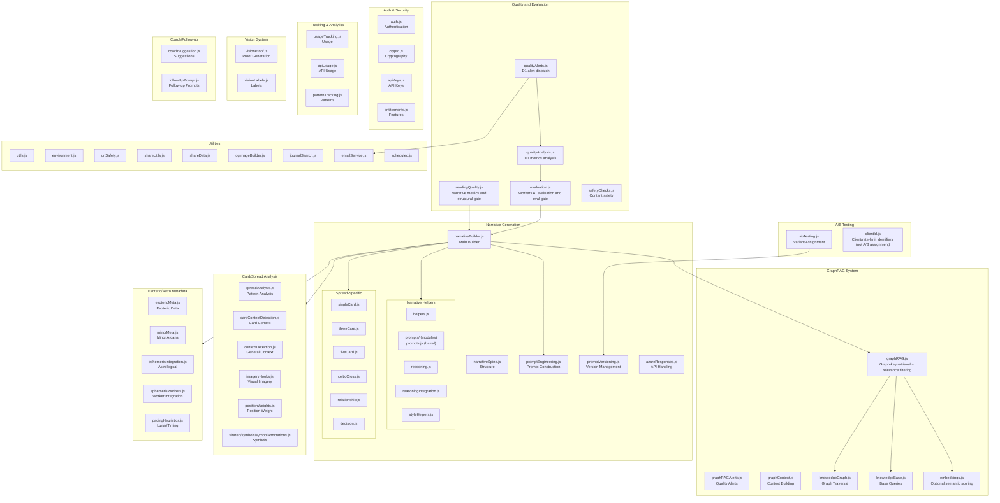

## 6. Shared Modules Architecture

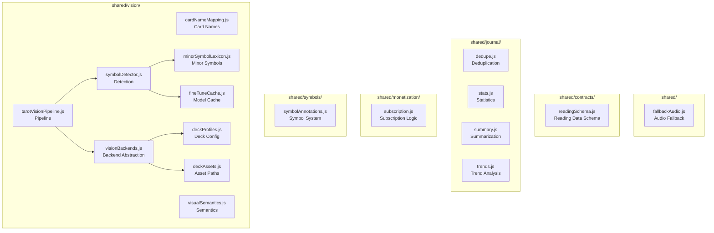

## 7. Data Flow Diagrams

### 7.1 Authentication Flow

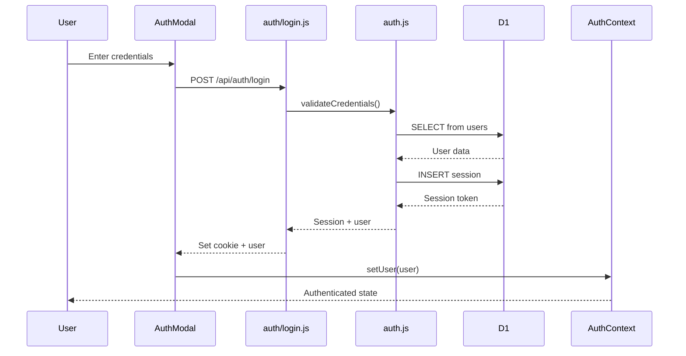

### 7.2 Payment/Subscription Flow

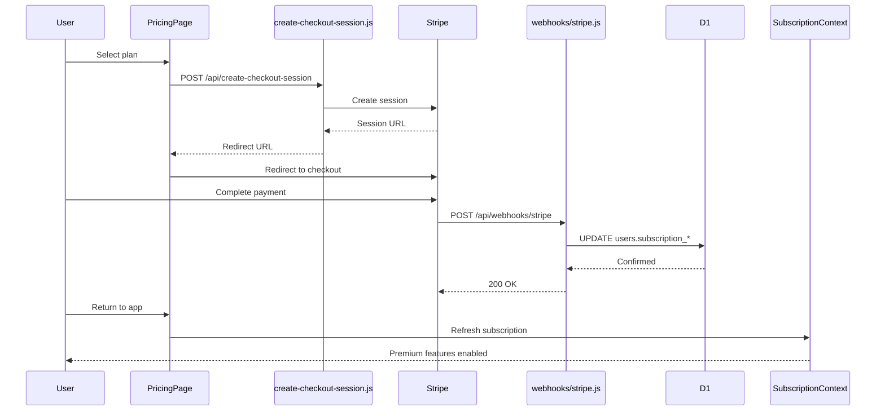

### 7.3 Reading Generation with GraphRAG Flow

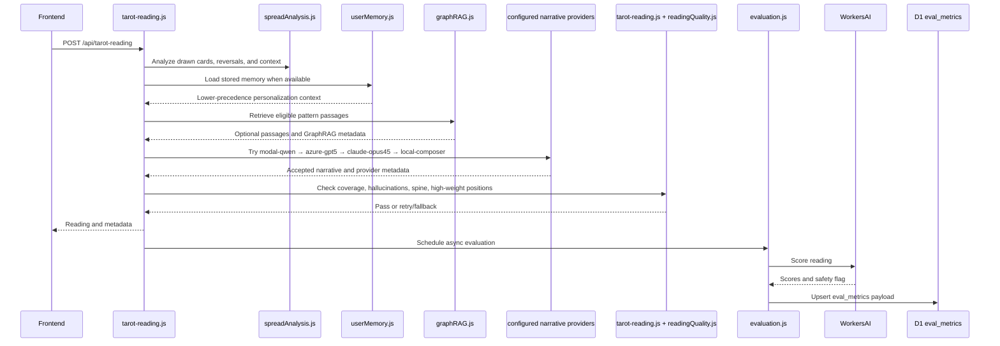

### 7.4 Vision Pipeline Flow

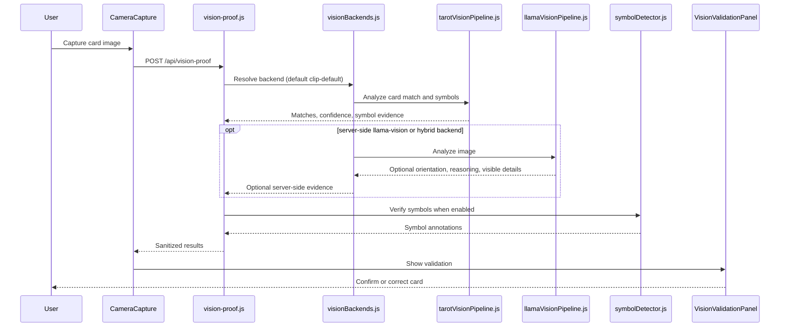

### 7.5 Quality Evaluation & Alerting Flow

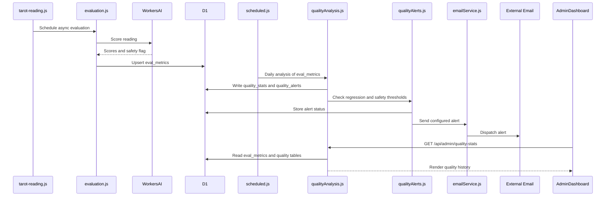

### 7.6 A/B Testing Flow (when enabled)

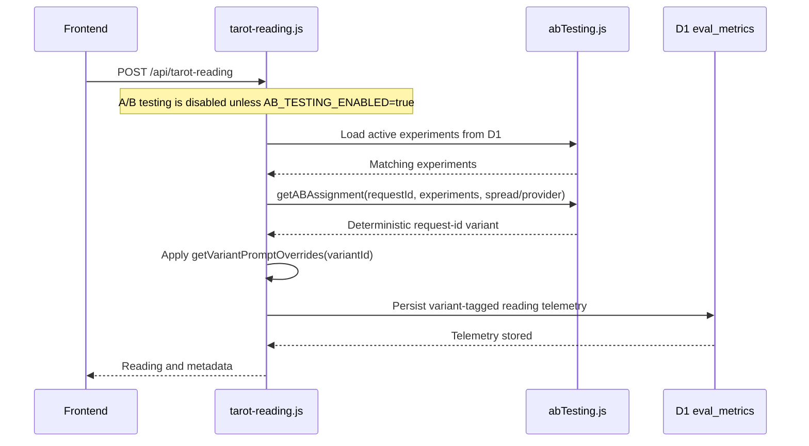

### 7.7 Journal Pattern Detection Flow

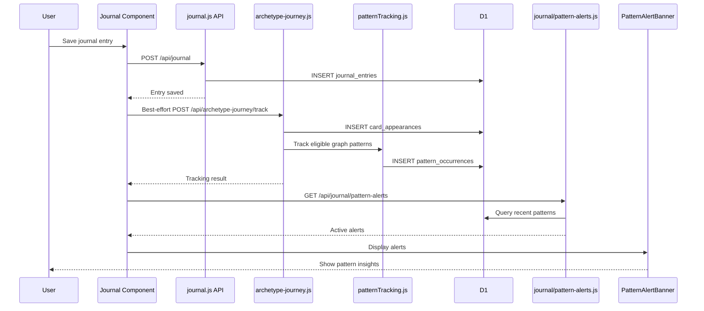

### 7.8 Follow-up Flow

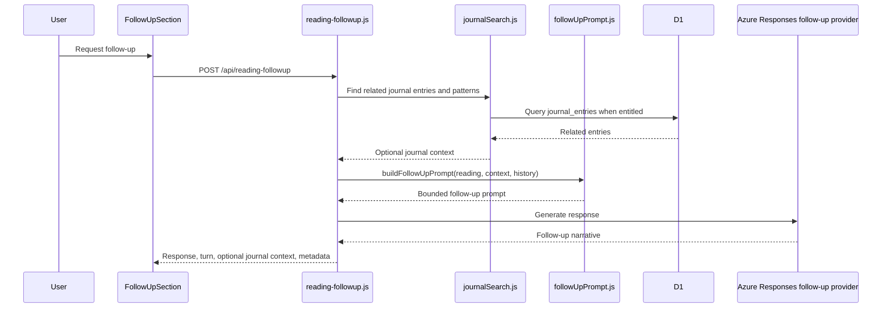

### 7.9 Archetype Journey Flow

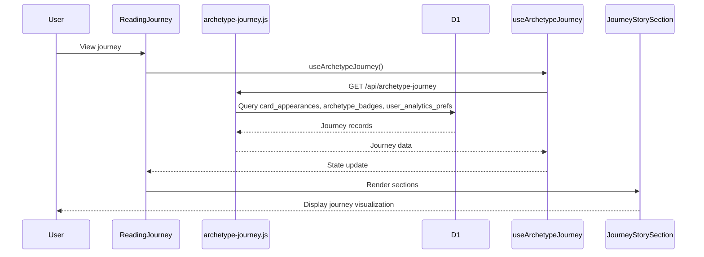

## 8. Database Schema Overview (Current)

`migrations/*.sql` is authoritative for columns and constraints. The table-name map below replaces the obsolete schema diagram; it intentionally does not infer relationships that are not defined by the migrations.

| Area | Current tables |
|---|---|
| Accounts and auth | `users`, `sessions`, `user_tokens`, `api_keys` |
| Journal and sharing | `journal_entries`, `journal_followups`, `share_tokens`, `share_token_entries`, `share_notes`, `share_note_reports` |
| Journey and patterns | `card_appearances`, `archetype_badges`, `user_analytics_prefs`, `pattern_occurrences`, `pattern_tracking_failures` |
| Personalization and follow-up | `user_memories`, `follow_up_usage` |
| Media and usage | `user_media`, `usage_tracking`, `processed_webhook_events` |
| Reading quality | `eval_metrics`, `quality_stats`, `quality_alerts`, `ab_experiments` |
| Compatibility archives | `metrics_archive`, `feedback_archive`, `archival_summaries` |
| OAuth operations | `oauth_registration_counters` |
| Migration bookkeeping | `_migrations` |
| Legacy reading tables | `readings`, `cards`, `reading_stats` |

The legacy reading tables are retained for compatibility; the current reading path stores journal content in `journal_entries` and runtime reading/evaluation telemetry in `eval_metrics`.

## 9. External Service Integrations

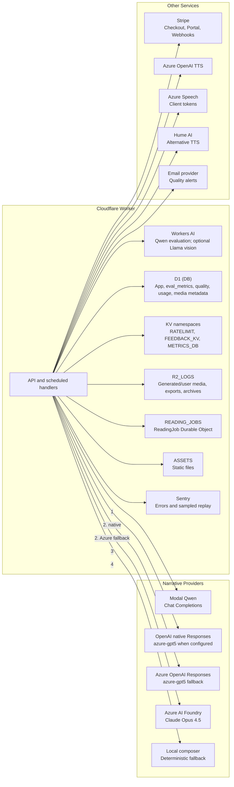

## 10. Component Hierarchy Summary

File and route counts are intentionally omitted because they change independently of the architecture. Use the repository tree and `src/worker/index.js` for an exact inventory.

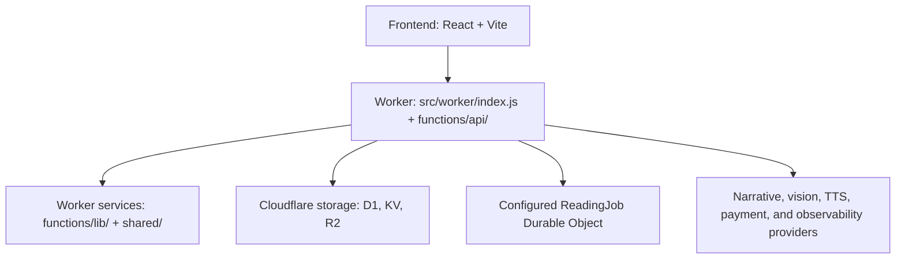

---

## 11. Historical CodeViz Export (Quarantined)

The previous generated CodeViz export was removed from this active reference because it contained obsolete paths, bindings, and schema assumptions. Do not use it for implementation. Any replacement export must be regenerated from `wrangler.jsonc`, `src/worker/index.js`, and `migrations/`.
