# Complete Architecture Diagram - Mystic Tarot Application

This document contains comprehensive Mermaid diagrams covering the full application architecture.

## 1. High-Level System Architecture

```mermaid
graph TB
    subgraph External["External Services"]
        Stripe["🔒 Stripe<br>Payment Processing"]
        AzureOpenAI["🤖 Azure OpenAI<br>GPT-5 Narrative"]
        AzureAnthropic["🤖 Azure Anthropic<br>Claude Fallback"]
        AzureTTS["🔊 Azure TTS<br>Text-to-Speech"]
        AzureSpeech["🎙️ Azure Speech SDK<br>Client Tokens"]
        HumeAI["🔊 Hume AI<br>Alternative TTS"]
        EmailService["📧 Email Service<br>Quality Alerts"]
    end

    subgraph Cloudflare["Cloudflare Infrastructure"]
        WorkersAI["⚡ Workers AI<br>Qwen Evaluation"]
        D1["🗄️ D1 Database<br>Primary Storage"]
        KV_Rate["📊 KV RATELIMIT<br>Rate Limiting"]
        KV_Feedback["📊 KV FEEDBACK_KV<br>User Feedback"]
        KV_Metrics["📊 KV METRICS_DB<br>Quality Metrics"]
        Assets["📦 Assets Binding<br>Static Files"]
        Logpush["📝 Logpush<br>Log Export"]
    end

    subgraph App["Tarot Application"]
        Frontend["🖥️ Frontend<br>React + Vite"]
        Worker["⚙️ Worker<br>src/worker/index.js"]
        Shared["📚 Shared<br>Isomorphic Modules"]
    end

    Frontend <-->|"API Calls"| Worker
    Worker --> WorkersAI
    Worker --> D1
    Worker --> KV_Rate
    Worker --> KV_Feedback
    Worker --> KV_Metrics
    Worker --> Assets
    Worker --> Logpush
    Worker -->|"Narratives"| AzureOpenAI
    Worker -->|"Fallback"| AzureAnthropic
    Worker -->|"Audio"| AzureTTS
    Worker -->|"Tokens"| AzureSpeech
    Worker -->|"Audio Alt"| HumeAI
    Worker -->|"Alerts"| EmailService
    Worker -->|"Payments"| Stripe
    Frontend --> AzureSpeech
    Shared -.->|"Used by"| Frontend
    Shared -.->|"Used by"| Worker
```

## 2. Frontend Application Architecture

## 3. Frontend Hooks & Libraries

## 4. Worker API Architecture

## 5. Backend Library Architecture

## 6. Shared Modules Architecture

## 7. Data Flow Diagrams

### 7.1 Authentication Flow

### 7.2 Payment/Subscription Flow

### 7.3 Reading Generation with GraphRAG Flow

### 7.4 Vision Pipeline Flow

### 7.5 Quality Evaluation & Alerting Flow

### 7.6 A/B Testing Flow

### 7.7 Journal Pattern Detection Flow

### 7.8 Coach/Follow-up Flow

### 7.9 Archetype Journey Flow

## 8. Database Schema Overview

## 9. External Service Integrations

## 10. Component Hierarchy Summary

---

## Quick Reference: File Counts

| Layer | Category | Count |
|-------|----------|-------|
| Frontend | Context Providers | 5 |
| Frontend | Pages | 8 |
| Frontend | Components | 159 |
| Frontend | Hooks | 27 |
| Frontend | Libraries | 26 |
| Frontend | Utils | 4 |
| Frontend | Data Sources | 8 |
| Worker | API Endpoints | 52 |
| Worker | Backend Libraries | 87 |
| Shared | Modules | 23 |
| External | Services | 12 |
## 11. CodeViz System Architecture Export

---
*Generated by [CodeViz.ai](https://codeviz.ai) on 1/14/2026, 3:19:18 PM*
