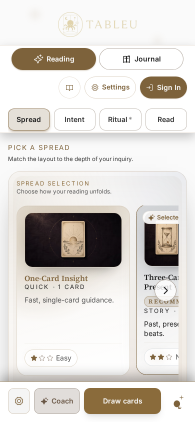
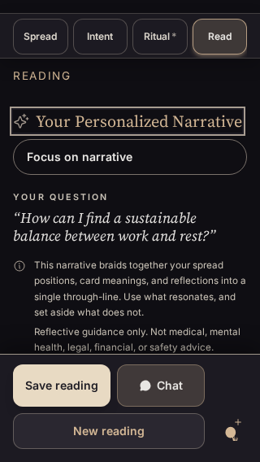
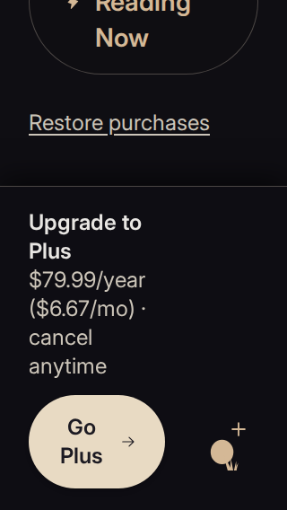

These Chromium captures show the compact install action beside the bottom reading and Pricing controls. The light guest reading uses a 390 × 844 viewport; the completed reading uses an isolated narrative fixture at 320 × 568. Annual Pricing uses a guest view at 320 × 568 with 200% text. No real reviewer identity or session state is included.

The screenshots came from the initial layout build, `app-DqFpqB5B.js`. Subsequent landscape label and keyboard visibility fixes leave these portrait layouts unchanged. The final build, `app-D-W-d4rI.js`, passed 32 production-preview installation regressions across Chromium and WebKit. The required pre-push Node suite passed 2,922 tests; build, scoped ESLint, and the layout detector also passed.

Guest and real signed-in Pro/active views were inspected. Nine narrative fixture lanes passed after correcting QA setup assumptions. Safe insets, large text, keyboard offsets, and native installation events were simulated. Physical iOS installation and WebKit touch swiping remain unverified. No production deployment is part of this PR.
