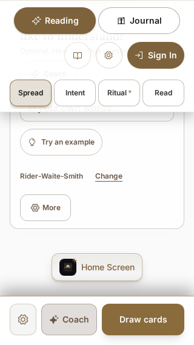
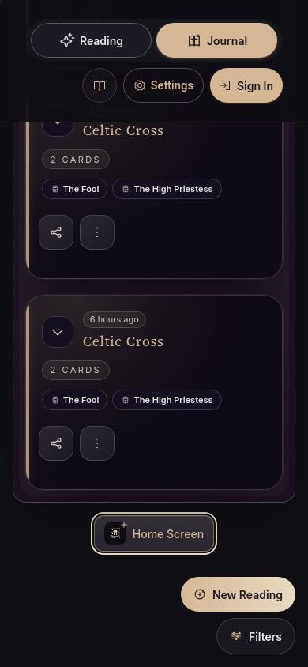
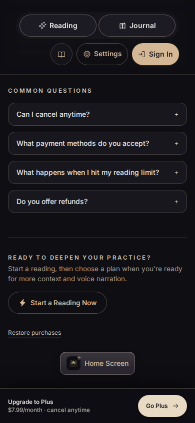
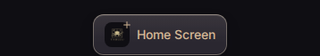

This isolated remediation of PR #102 addresses all seven findings and the related focus, error, spacing, and iOS reminder issues from the review of `44c3523`. The remediation was prepared on `fix/pr102-install-controls` for PR #102; this evidence does not represent a deployment.

| Finding | Result |
| --- | --- |
| 1. Broken sprite and weak affordance | The existing raster octopus mark sits in a raised secondary button with a highlighted top edge, soft shadow, border, and visible label. The pressed shadow compresses without moving the target. |
| 2. Journal controls cover installation | Every page owns its install footer inside its content column and measured bottom clearance. Populated Journal controls no longer cover it. |
| 3. Footer appears during route loading | The footer mounts with its page inside the route boundary. Route/width/gutter lists and `pricingOwnsAction` are removed. |
| 4. Late offers move reading actions | Installation lives at page end. Reading and Pricing docks contain their primary tasks, with no install placeholder. Coach retains its label at 320px. |
| 5. Persistent error blocks the reading | Failures use the existing dismissible, expiring toast. Persistent initially empty live regions announce later text changes and repeated failures. |
| 6. Native offers suppressed without a control | Only mounted eligible page hosts claim `beforeinstallprompt`. Share, admin, callback, and cold suspended routes leave uncached offers with Chrome. |
| 7. Install UI increases startup cost | The guide and control load lazily after iOS eligibility or a browser offer. |

iOS guidance offers **Later** (seven days) and **Already added** (hide on this browser). Standalone/app-installed state also remembers the added choice. Storage writes are read back exactly; denied, thrown, or silent failures hide guidance for the visit and explain that the choice could not be saved. Expiry, reloads, route changes, and other tabs are covered.

Focus return uses host callbacks or refs rather than aria-label selectors or `:has()`. The footer selects the final available page action by document order, avoiding WebKit's temporarily stale viewport coordinates after fixed-body scroll restoration. A page with no other action retains focus in its own main. Reading dock clearance is reserved once inside main; duplicate shell padding previously scrolled the footer behind the sticky header in short landscape views. Landscape scrollers include ring clearance, recheck focus after a rendering frame, and observe action sizes when fonts or larger text reflow.

The duplicated eligibility expression and dead slot attribute are removed. Pricing relies on its ResizeObserver, with a resize fallback only when unavailable. Twelve existing lint diagnostics in touched Journal, Account, Gallery, and verification pages are fixed through derived/owner-keyed state and cancellation of obsolete requests, without lint suppression.

The final production entry is **`app-DBO6rHdL.js`**, **305,166 raw bytes / 101,670 gzip bytes** using Node's `gzipSync`. The reviewed PR entry was 317,317 raw bytes: this remediation removes 12,151 bytes. The guide is a separate `InstallApp-Cb4MJfeK.js` chunk; the entry contains neither guide copy nor the maskable-icon reference. Its raised-surface styling is also a separate lazy CSS asset. All 32 dark/light button-state captures across eight Chromium/WebKit mobile and desktop contexts retain the button’s size and position; text contrast is at least 6.32:1 dark and 4.75:1 light.

Validation is recorded in [the machine-readable checks](comprehensive/checks.json). The final Node suite passed **2,942/2,942**, including 38 install-store tests. All **75/75 production installation regressions** passed against the final build in one uninterrupted run with one worker. Scoped ESLint, the raised-control detector, documentation links, and diff checks passed. Earlier repeated WebKit focus/ring and page-state checks are labeled by their verification stage in the checks file.

The [fresh full-suite record](comprehensive/full-suite.json) preserves the raw result: **522 passed, 23 failed, 19 skipped (564 total)** against frozen source on private Vite. Twenty failures match the reviewed PR-head baseline. The other two Journal preparation cases passed unchanged in the final production run; traces show 14–15.5 second frame waits exhausting their polling deadlines during parallel rendering. The remaining Account theme case passed **3/3** unchanged isolated repetitions against the same Vite configuration. No assertion, timeout, media setting, or source change was used for those rechecks. This qualifies the follow-up cases without calling the original full run green.

Repository-wide lint still reports 117 errors and 36 warnings. Every diagnostic comes from a file byte-identical to HEAD; the ESLint configuration is unchanged.

Guest render coverage uses actual Chromium 151.0.7922.34 and WebKit 26.5 with touch/iOS emulation, blocked service workers, and isolated API/narrative fixtures. [Rendered metrics](comprehensive/metrics.json) record the build and each sampled point. Ten synthetic Journal entries force the floating controls into view at 390×844, 800×1000, and 1024×768. Geometry reaches the current document end after fonts and measured reservations settle; post-close focus checks make no corrective scroll.

Real local Pro/active review authenticated against the local Worker, verified `/api/auth/me`, and checked Pricing, Journal, Account, and Gallery on the final assets. All four footers passed five-point hit testing; Pro Pricing has no upgrade dock. Cropped captures exclude account identity. Logout returned 200 and the context closed. Free/Plus/expired behavior has separate mocked browser coverage; real accounts for those tiers were not used.

[Desktop/assistive-technology evidence](comprehensive/desktop-assistive.json) records a trusted Chrome install offer left uncanceled during a cold Journal load, no Chrome installability/manifest errors, and two repeated failure messages in Orca's speech output with local focus return. A separate isolated Chrome profile completed `PWA.install`, selected standalone through `PWA.changeAppUserSettings`, launched a rendered standalone Journal without an install control, and completed `PWA.uninstall`. This uses the [official DevTools PWA API](https://chromedevtools.github.io/devtools-protocol/tot/PWA/) and does not exercise a user's native confirmation dialog. Live-region checks follow the [W3C ARIA19 technique](https://www.w3.org/WAI/WCAG21/Techniques/aria/ARIA19).

Physical iOS/Android installation, Android's real offer timing, touch keyboard/swiping behavior, VoiceOver, and TalkBack remain unverified. Linux Orca speech-output logs qualify that desktop lane; audible output and mobile screen readers were not tested. Desktop Chrome promotion and automated installation use isolated local browser profiles and do not establish mobile timing.

[Button-state metrics and crops](comprehensive/floating-button/metrics.json) record default, hover, pressed, and focus states. All 23 final layout lanes and all 32 state captures are clean. One earlier isolated WebKit ResizeObserver deferred-notification warning is retained in the layout metrics as diagnostic history; it did not reproduce in the final pass or in three equivalent final-build lifecycle repetitions. No resize-warning suppression or source change was added.

Representative final captures:

