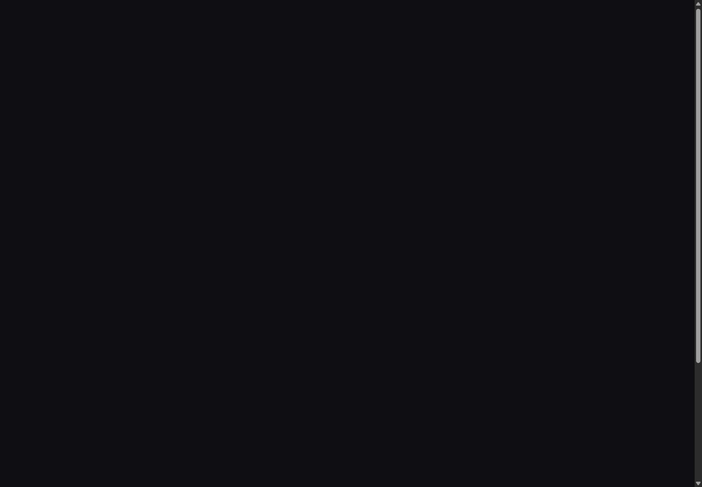
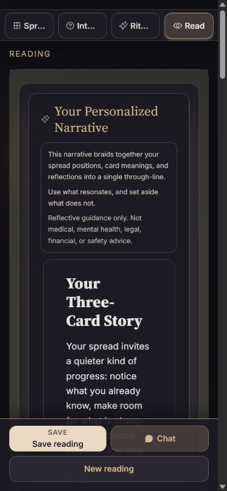
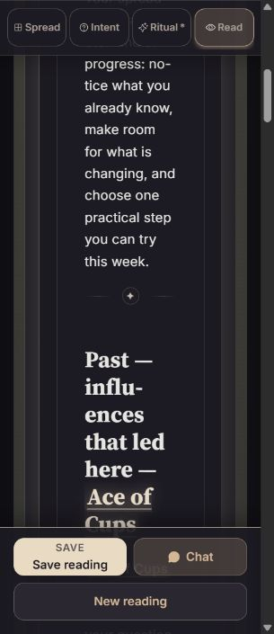
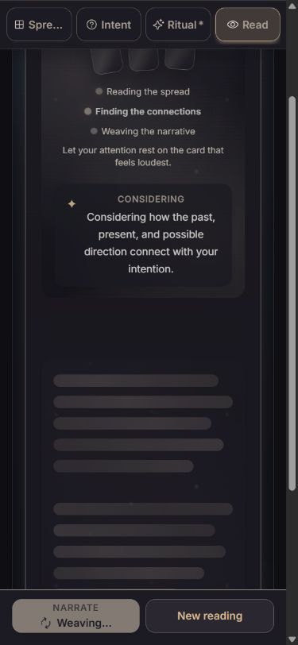

# Personalized reading generation and rendering audit

23 September 2026 · Current working tree on `master`, base `4f0e125` · Read-only application audit

**Implementation integrity: fail for release readiness.** The Midnight Reading Room identity is coherent, but generation, completion, and failure do not share a reliable state contract. A motion-preference change can hide the page, mobile framing consumes most of the prose width, and desktop failure recovery omits retry.

**8 findings: 1 P0, 2 P1, 5 P2, no P3.** No application code was changed. Existing work in the reading context, API, worker, tests, lockfile, and Wrangler configuration was preserved. Only this report, screenshots, and local audit fixtures were added under `output/reading-audit/`.

| Dimension | Score / 4 | Main evidence |
|---|---:|---|
| Accessibility | 2 | Reduced-motion change hides page; partial/error content announces success; small secondary controls |
| Performance | 3 | Mobile reading suppresses ambient effects; loading runs 22 CSS animations; no device frame-time profile |
| Responsive design | 1 | Prose measures 147 px at 390 px and 107 px at 320 px |
| Theming | 2 | Main text and panels adapt; nested scene shells retain hard-coded dark gradients |
| Implementation integrity | 2 | Coherent visual identity, but contradictory progress/completion/error behavior |
| **Total** | **10/20** | **Acceptable band: significant work needed; blocking defect takes priority over the score** |

## Flow and evidence

The actual React app ran through draw, deal, reveal, generation, partial streaming, completion, failure, and retry. A local HTTP fixture supplied controlled SSE events so these states could be held and inspected without calling a model provider. Narrative text is synthetic and follows the actual cards submitted by the UI. It is layout evidence, not an evaluation of generated reading quality.

| Step | State | Health | Current-run evidence |
|---|---|---|---|
| 1 | Generation and extended wait | Needs simplification | [Desktop loading](01-loading-desktop.png), [390 px loading](02-loading-mobile-viewport.png), [reduced-motion loading](11-loading-reduced-motion.png) |
| 2 | Partial server stream | Incorrect completion announcement | [Partial reading after navigation recovery](04-streaming-320-recovered.png); accessibility tree said “Narrative ready” while the dock said “Weaving…” |
| 3 | Completed reading | Desktop readable; phone severely constrained | [Desktop](06-reading-desktop.png), [390 px](05-reading-mobile.png), [320 px](08-reading-320.png), [320 px prose](09-reading-320-prose.png), [landscape](10-reading-landscape.png) |
| 4 | Reduced-motion preference change | Blocking visibility failure | [Blank page](14-reduced-motion-recheck.png), [computed opacity and paused animation evidence](motion-recheck.json) |
| 5 | Generation error and recovery | Mobile retry works; desktop retry absent | [Mobile error](12-error-mobile.png), [desktop error](13-error-desktop.png) |
| 6 | Light theme | Partial adaptation | [Light reading](07-reading-light-desktop.png) |

## Findings in priority order

### 1. [P0] Changing to reduced motion can leave the whole page invisible

**Category:** Accessibility / implementation integrity.

Reproduced twice in the in-app Chromium browser: once during generation and again on the error screen, independently of resizing. After `prefers-reduced-motion` changed from `no-preference` to `reduce`, the page wrapper had inline `opacity: 1` but computed `opacity: 0`. A paused Web Animation remained at time 0 with opacity keyframes `[0, 1]`. The accessibility tree still contained the reading and controls. This is a painted-content failure, not a missing-data state. Navigating away and back under reduced motion restored content.

**Location:** [PageTransition.jsx:17](C:/Users/htper/tarot/src/components/PageTransition.jsx:17), especially the opacity assignment at line 26 and pause-only cleanup at line 33; [motionAdapter.js:305](C:/Users/htper/tarot/src/lib/motionAdapter.js:305). `set()` itself starts a zero-duration animation rather than making an unconditional style assignment. The retained paused effect can override the apparent restored value. SceneShell also retained content opacity 0.88 after loading transitions, though that did not itself blank the page.

**Impact:** A user who enables reduced motion can lose every visible reading control and the reading itself.

**Recommendation:** Make page content visible by default, keep decorative animation independent of content availability, and cancel/release animation effects during cleanup. Confirm computed opacity through all ancestors after preference changes, interruption, navigation, and lifecycle suspension.

**Suggested command:** `$impeccable harden`, followed by `$impeccable animate`.

### 2. [P1] Nested containers reduce mobile prose to roughly a third of the screen

**Category:** Responsive design / layout.

Measured paragraph widths: **591 px on a 1440 px viewport; 147 px on 390 px; 107 px on 320 px**. At 320 px, headings and normal sentences become columns of one to three words, with distracting hyphenation. The problem is cumulative padding and containment, not small font size: body text remains 16 px on mobile.

**Location:** [NarrativeStageLayout.jsx:28](C:/Users/htper/tarot/src/components/reading/NarrativeStageLayout.jsx:28) and line 36; [narrativeReadingModelUtils.js:203](C:/Users/htper/tarot/src/hooks/narrativeReadingModelUtils.js:203); [StreamingNarrative.jsx:496](C:/Users/htper/tarot/src/components/StreamingNarrative.jsx:496); [MarkdownRenderer.jsx:14](C:/Users/htper/tarot/src/components/MarkdownRenderer.jsx:14); [tarot.css:3974](C:/Users/htper/tarot/src/styles/tarot.css:3974). Each layer adds padding, a width constraint, or both.

**Impact:** A moderate reading becomes an unusually long scroll. Headings lose scanability, and the fixed dock obscures part of the already limited reading viewport.

**Recommendation:** Give one container responsibility for mobile horizontal gutters. Remove nested mobile framing and redundant padding; retain the established desktop line-length cap. Aim for approximately 280 px of prose at 320 px and 340 px at 390 px, allowing for the actual scrollbar and safe areas.

**Suggested command:** `$impeccable layout`, then `$impeccable adapt`.

### 3. [P1] Desktop errors offer a new draw instead of retrying the same reading

**Category:** Implementation integrity / error recovery.

The same SSE error produces a working **Retry narrative** action on mobile. Desktop renders the error as narrative text and offers **Draw new reading**, which resets the spread. No desktop retry control appeared anywhere in the DOM. Switching to mobile and activating retry restarted generation successfully.

**Location:** [CompleteScene.jsx:16](C:/Users/htper/tarot/src/components/scenes/CompleteScene.jsx:16) and its NewReadingSection; [NewReadingSection.jsx:8](C:/Users/htper/tarot/src/components/reading/complete/NewReadingSection.jsx:8); [narrativeReadingModelUtils.js:188](C:/Users/htper/tarot/src/hooks/narrativeReadingModelUtils.js:188); compare the retry-aware logic in [MobileActionBar.jsx:123](C:/Users/htper/tarot/src/components/MobileActionBar.jsx:123).

**Impact:** A transient failure can require abandoning the selected cards and the reflection already invested in them. “Please try again” has no corresponding desktop action.

**Recommendation:** Render a dedicated error state with retry for the existing cards, question, and reflections at every breakpoint. Keep starting over secondary. Suppress “How did this reading land?” feedback when no valid narrative exists.

**Suggested command:** `$impeccable harden`.

### 4. [P2] Completion announcements disagree with the actual generation state

**Category:** Accessibility / implementation integrity.

“Narrative ready” was present in the live region during both a partial stream and a generation error. Meanwhile, the mobile dock correctly said “Weaving…” or “Retry narrative.” In addition, the loader stays on its second step while streaming: `drafting` is set before job creation, while `polishing` and `complete` are set back-to-back after the final event. The three visible steps therefore do not describe three observable server phases in this path.

**Location:** [StreamingNarrative.jsx:440](C:/Users/htper/tarot/src/components/StreamingNarrative.jsx:440) and live region at line 539; [NarrativeBody.jsx:33](C:/Users/htper/tarot/src/components/reading/narrative/NarrativeBody.jsx:33); [ReadingContext.jsx:624](C:/Users/htper/tarot/src/contexts/ReadingContext.jsx:624) and line 1035; [NarrativeSkeleton.jsx:155](C:/Users/htper/tarot/src/components/NarrativeSkeleton.jsx:155).

**Impact:** Assistive-technology users receive a false success signal. Sighted users receive a detailed progress story that cannot reliably track completion. Keyboard activation of generation also dropped focus to the body when its trigger became disabled; no reading-heading focus handoff occurred in the observed flow.

**Recommendation:** Pass explicit server-streaming, complete, and error states into the renderer and its live region. Announce completion only after the final successful event. Use an honest indeterminate status unless actual phase events exist. Define a predictable focus handoff without moving focus on every token. This is a status-message accessibility concern; no physical screen-reader session was performed.

**Suggested command:** `$impeccable harden`, then `$impeccable clarify`.

### 5. [P2] Loading spends most of the phone viewport on decoration before useful status

**Category:** Responsive design / performance / motion.

The main loading card was about **990 px high at 390 px viewport width**, exceeding the 844 px viewport before considering the fixed navigation and action dock. The actual “Interpreting…” message appears below the skeleton paragraphs. The opening hint asks the user to attend to a card, but the drawn artwork has been replaced by anonymous card shapes.

Normal-motion inspection counted **22 running CSS animations**: ten background-position shimmers, three floating cards, three bouncing dots, three pulses, two atmosphere drifts, and a step pulse. Particles and backdrop filters are additional effects; they are not included in that count. The bundled detector flagged `animate-bounce` at NarrativeSkeleton line 344. Its easing is overridden, but the vertical bounce remains real. This is evidence of redundant motion and repaint work, not proof of dropped frames.

**Location:** [NarrativeSkeleton.jsx:218](C:/Users/htper/tarot/src/components/NarrativeSkeleton.jsx:218), panel at line 311 and status at line 335; [tarot.css:4250](C:/Users/htper/tarot/src/styles/tarot.css:4250); [InterludeScene.jsx:54](C:/Users/htper/tarot/src/components/scenes/InterludeScene.jsx:54).

**Impact:** Users must scroll to find reassurance during a long wait. Several simultaneous effects compete for attention without communicating additional state.

**Recommendation:** Put a real loading heading and status first, followed by one restrained activity cue. Use fewer skeleton lines on phones, preserve a small reference to the actual spread if keeping the card-attention hint, and consolidate motion. Keep the extended-wait message visible and truthful.

**Suggested command:** `$impeccable distill`, `$impeccable animate`, and `$impeccable optimize`.

### 6. [P2] Mobile hides the personal question until after the entire interpretation

**Category:** Layout / reading comprehension.

Desktop places the question above the reading; mobile explicitly moves it below all narrative text. The mobile opening instead contains a long explanatory/safety card and a second title. At 320 px, the initial reading viewport ends before meaningful body prose begins. The 844×390 landscape view likewise initially shows framing, title, and question rather than reading content.

**Location:** [NarrativeBody.jsx:23](C:/Users/htper/tarot/src/components/reading/narrative/NarrativeBody.jsx:23), safety notice at line 31, mobile anchor at line 51; [NarrativeSafetyNotice.jsx](C:/Users/htper/tarot/src/components/NarrativeSafetyNotice.jsx).

**Impact:** The user's own intention is least accessible on the device where recalling it requires the most scrolling.

**Recommendation:** Keep a compact question anchor above the reading on every breakpoint. Preserve the safety boundary in concise opening copy, with longer explanation available through a disclosure. Let the narrative title and first paragraph appear much earlier.

**Suggested command:** `$impeccable layout`, then `$impeccable clarify`.

### 7. [P2] Secondary reading controls miss the project's 44 px target size

**Category:** Accessibility / responsive design.

On the completed 390 px reading, Play/Read this aloud and View Journal measured approximately **33.3 px high**. Spread Insights measured **24 px high**. The primary mobile dock correctly uses 44 px buttons.

**Location:** [NarrationControls.jsx:15](C:/Users/htper/tarot/src/components/reading/narrative/NarrationControls.jsx:15) and line 48; [SpreadPatterns.jsx:126](C:/Users/htper/tarot/src/components/SpreadPatterns.jsx:126). Focus on narrative also lacks a minimum touch height in [NarrativePanelHeader.jsx:19](C:/Users/htper/tarot/src/components/reading/narrative/NarrativePanelHeader.jsx:19).

**Impact:** Supporting controls are harder to hit than the principal actions, particularly near the end of a long reading.

**Recommendation:** Apply the existing touch-target minimum consistently, enlarging the clickable area without forcing larger text. This violates the repository's 44 px design requirement; it is not automatically a WCAG 2.1 AA failure, because 44 px target size is a stricter target-size criterion.

**Suggested command:** `$impeccable adapt`.

### 8. [P2] Light mode retains large dark scene frames around light reading cards

**Category:** Theming.

Applying the app's light root class updated text and narrative surfaces, but the large outer scene and nested scene panel remained dark. The result is a light card surrounded by thick dark frames, with stronger visual separation than the dark version.

**Location:** [SceneShell.jsx:18](C:/Users/htper/tarot/src/components/scenes/SceneShell.jsx:18), backdrop rendering at line 268; [tarot.css:317](C:/Users/htper/tarot/src/styles/tarot.css:317), especially the literal dark gradient at line 323.

**Impact:** The same nested frames that constrict mobile reading become more dominant in light mode, weakening the intended “same room by day” design rule.

**Recommendation:** Theme the shared scene surfaces and atmospheric gradients using existing semantic tokens. Retain the warm palette while allowing the scene hierarchy to adapt with the reading card.

**Suggested command:** `$impeccable colorize`, then `$impeccable polish`.

## Keep these strengths

- Serif headings, warm accents, and dark paper-like surfaces give the reading a recognizable identity.
- Desktop prose has a comfortable bounded width; semantic Markdown headings and lists make sections scannable.
- Reduced motion eliminates continuous loading and reading animations after a clean remount. The preference-change lifecycle is the failure, not an absence of a reduced-motion treatment.
- Mobile completion uses stable surfaces and removes scene particles; the server-streamed path avoids an extra typing replay.
- Mobile retry works. The fixed primary dock has suitably sized actions.
- Narrative text updates use `aria-live="off"`, with a separate concise status region, avoiding token-by-token announcements. The status content needs correction.

## Verification and limits

- Rendered at 1440×1000, 390×844, 320×740, and 844×390 in the in-app browser. Captures are from this audit run; full-page captures with unreliable scaling were excluded from this report.
- Normal and reduced motion, preference changes, keyboard generation activation, partial streaming, extended wait, completed Markdown, error text, mobile retry, and light CSS theme were inspected. The opacity failure reproduced twice.
- Scoped axe checks on the completed desktop reading: **0 automatic violations, 17 passing rule categories** in both dark and light states. **54 contrast nodes remained inconclusive** in each run because of layered backgrounds. See [dark result](axe-dark-desktop.json) and [light result](axe-light-desktop.json). This is not a WCAG conformance claim.
- Detector: one scoped finding, the real bounce animation. Hard-coded scene colors were separately verified in source and rendered light mode.
- Fixture responses exercise the current UI and client stream code. They do not verify production networking, actual provider latency, generated content quality, billing, narration playback, saved journal persistence, or premium media generation. Fixture reconnects are not reported as production defects.
- The three-card flow was rendered. Other spread skeleton counts were inspected in source but were not fully exercised. Physical devices, VoiceOver/NVDA, text zoom, and frame-time/battery profiling were not tested.
- No build, full test suite, deployment, migrations, or publication was run for this read-only audit.

## Recommended sequence

1. `$impeccable harden`: fix visible-default motion cleanup, desktop retry, and truthful completion/error state.
2. `$impeccable layout` + `$impeccable adapt`: give prose one mobile gutter, keep the question near the beginning, and normalize target sizes.
3. `$impeccable distill` + `$impeccable animate`: shorten loading and consolidate its motion around useful status.
4. `$impeccable colorize`: complete the scene-level light theme.
5. `$impeccable polish`: align the resulting spacing, type rhythm, and remaining transitions.

These can be run individually or together. Re-run `$impeccable audit` after fixes, with the visibility defect and mobile prose widths as explicit acceptance checks.
