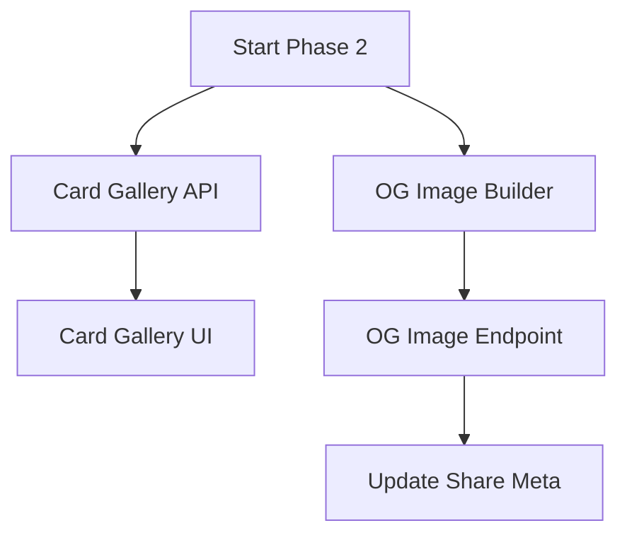

# Phase 2 Implementation Plan: Engagement & Virality

## Executive Summary

Phase 2 focuses on deepening user engagement through gamification (Card Gallery) and improving external visibility through social sharing enhancements (Social Cards/OG Images).

---

## 1. Card Gallery ("The Collection")

### Overview
A visual grid of all 78 cards showing which ones the user has "collected" (drawn) and how often. This turns the journey into a collection mechanic, encouraging exploration of the full tarot deck.

### Architecture

#### 1.1 New Page Component: `src/pages/CardGalleryPage.jsx`
- **Route:** `/journal/gallery`
- **Layout:**
  - Header: Collection progress (e.g., "65/78 cards discovered")
  - Filter Bar: Suit, Frequency (High/Low), Never Seen
  - Grid: 78 Card slots
    - **Seen:** Full color card image + Frequency Badge + Last Seen Date
    - **Unseen:** Dimmed/Silhouette or Card Back + "?" Label

#### 1.2 Component Structure
- `CardGalleryGrid`: Responsive grid layout
- `GalleryCard`: Individual card item with interactive hover state (flip for stats?)
- `CollectionStats`: Progress bar and summary metrics

#### 1.3 Data Source
- **New API Endpoint:** `GET /api/archetype-journey/card-frequency`
  - Returns aggregation of ALL time card appearances
  - Includes `first_seen`, `last_seen`, `total_count` for every card
  - Front-end needs to map this against the static list of 78 cards to identify "never seen" ones.

#### 1.4 Integration
- Add link from `JournalInsightsPanel` ("Frequent Cards" section footer)
- Add navigation item in `UserMenu` or main `GlobalNav`

### Implementation Steps
1.  **Backend:** Create `functions/api/archetype-journey/card-frequency.js`
    - Query `card_appearances` grouped by card.
    - Return JSON map of card stats.
2.  **Frontend:** Create `src/pages/CardGalleryPage.jsx`
    - Fetch data on mount.
    - Render grid.
    - Implement filtering logic.
3.  **Router:** Add route to `src/main.jsx` (or wherever routes are defined).

---

## 2. Social Cards (OG Images)

### Overview
Dynamically generate beautiful Open Graph images when a reading share link is unfurled on social media (Twitter, Discord, iMessage, etc.).

### Architecture

#### 2.1 Endpoint: `GET /api/share/[token]/og-image`
- **Input:** Share token
- **Process:**
  1. Lookup share record and associated reading(s).
  2. Generate an SVG template populated with:
     - Reading Spread Name
     - Date
     - Top 3 Cards (images/names)
     - Key Theme/Question
  3. Return SVG (Cloudflare Pages automatically handles SVG, or use a conversion if needed for specific platforms, but SVG often works or can be rasterized by edge functions if we add a library).
  - *Note:* Pure SVG is lightweight. For broader compatibility (e.g., Twitter), we might need to use `@resvg/resvg-wasm` or similar, but let's start with a high-quality SVG that many modern scrapers accept, or implement a basic rasterizer.
  - *Refined Plan:* Use `satori` + `resvg` if possible within Cloudflare constraints, or stick to a highly optimized SVG and let the client meta tags point to it.

#### 2.2 SVG Template (`functions/lib/ogImageBuilder.js`)
- Design a card layout that looks good at 1200x630.
- Use the "Amber/Dark" aesthetic of the app.
- Include the Mystic Tarot logo/brand.

#### 2.3 Integration
- Update `functions/api/share/[token].js` (HTML response) to include `<meta property="og:image" ...>` pointing to the new endpoint.

### Implementation Steps
1.  **Lib:** Create `functions/lib/ogImageBuilder.js` to generate the SVG string.
2.  **API:** Create `functions/api/share/[token]/og-image.js` endpoint.
3.  **Meta:** Update the share page HTML generation to include the tags.

---

## 3. Dependency Graph

## 4. Effort Estimates
- **Card Gallery API:** 1 day
- **Card Gallery UI:** 3 days
- **Social Cards:** 2 days
- **Total:** ~1 week
