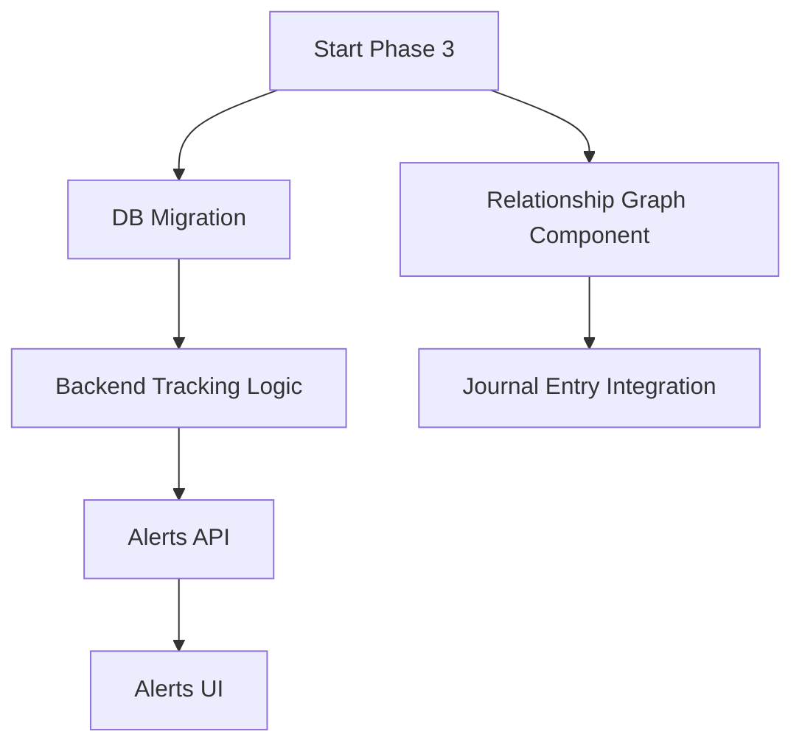

# Phase 3 Implementation Plan: Advanced Intelligence

## Executive Summary

Phase 3 introduces "Advanced Intelligence" features that leverage the underlying knowledge graph and pattern detection capabilities to surface deeper insights to the user. This transforms the journal from a passive record into an active guide.

---

## 1. Pattern Alerts

### Overview
Automatically detect and notify users when specific card combinations (dyads, triads) or archetypal patterns appear frequently across their readings.

### Architecture

#### 1.1 Database Schema
**Table:** `pattern_occurrences`
- `id`: PK
- `user_id`: FK to users
- `pattern_type`: 'triad', 'dyad', 'progression'
- `pattern_id`: String identifier (e.g., 'death-temperance-star')
- `entry_id`: FK to journal_entries
- `year_month`: YYYY-MM for easy aggregation
- `created_at`: Timestamp

#### 1.2 Backend Logic
- **Library:** `functions/lib/patternTracking.js`
  - `trackPatterns(db, userId, entryId, themes)`: Parses `themes.knowledgeGraph` from a reading and inserts into DB.
- **Integration:** Call `trackPatterns` inside `functions/api/archetype-journey.js` (handleTrackCards).
- **API Endpoint:** `GET /api/journal/pattern-alerts`
  - Returns patterns appearing 3+ times in the last 90 days.
  - Enrich with pattern metadata (name, description) from `knowledgeGraphData.js`.

#### 1.3 UI Component
- **Component:** `src/components/PatternAlertBanner.jsx`
  - Displays a mystical, dismissible notification when a pattern is detected.
  - "The Healing Arc has appeared 4 times recently."
- **Integration:** Place in `JourneySidebar.jsx` or top of `Journal.jsx`.

### Implementation Steps
1.  **Migration:** Create `migrations/0013_add_pattern_tracking.sql`.
2.  **Backend Lib:** Create `functions/lib/patternTracking.js`.
3.  **API:** Create `functions/api/journal/pattern-alerts.js`.
4.  **Hook:** Update `functions/api/archetype-journey.js`.
5.  **Frontend:** Create `PatternAlertBanner.jsx` and integrate.

---

## 2. Card Relationships Visualization

### Overview
Visualizing the connections between cards in a specific reading using a network graph or chord diagram.

### Architecture

#### 2.1 Component: `CardRelationshipGraph.jsx`
- **Library:** Use SVG for a lightweight implementation (nodes and edges).
- **Input:** `entry` object (specifically `themes.knowledgeGraph`).
- **Layout:**
  - Nodes: Card icons/thumbnails.
  - Edges: Lines connecting related cards (dyads/triads) with labels.

#### 2.2 Integration
- Add to `JournalEntryCard.jsx` in the expanded view, perhaps under a "Pattern Analysis" tab or toggle.

### Implementation Steps
1.  **Component:** Create `src/components/charts/CardRelationshipGraph.jsx`.
2.  **Integration:** Update `JournalEntryCard.jsx` to render it when relevant data exists.

---

## 3. Dependency Graph

## 4. Effort Estimates
- **Pattern Alerts:** 3 days
- **Relationship Graph:** 2 days
- **Total:** ~1 week
