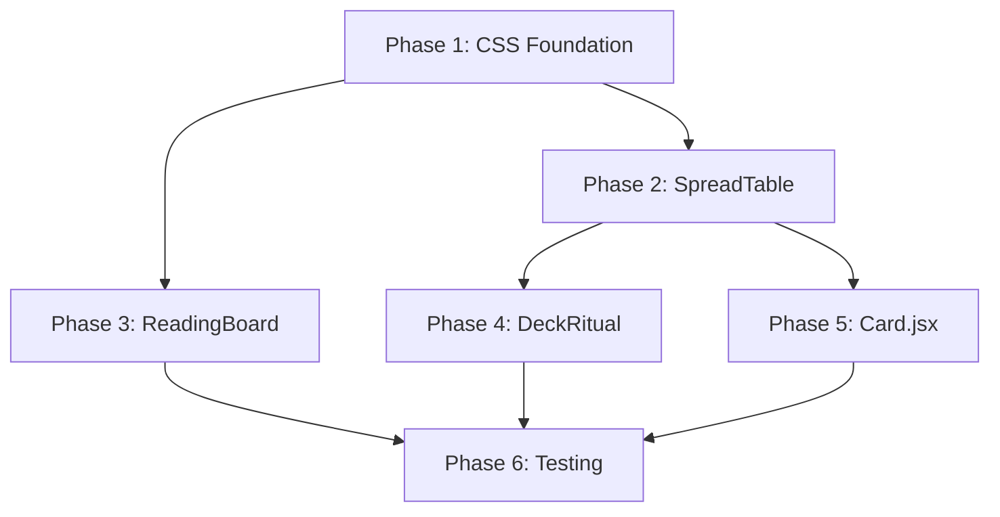

# Card Reveal Visual Enhancements Implementation Plan

## Overview

This plan implements visual enhancements to the card reveal UI based on the [theme swatch](../docs/theme-swatch.html) design system. The changes affect SpreadTable, ReadingBoard, Card, and DeckRitual components.

---

## Phase 1: CSS Foundation (Theme Tokens)

### Task 1.1: Add Theme Animation Variables to tarot.css

**File:** `src/styles/tarot.css`

Add the following CSS custom properties (align with theme-swatch.html):

```css
:root {
  /* Animation Timing Scale */
  --duration-fast: 160ms;
  --duration-normal: 200ms;
  --duration-medium: 260ms;
  --duration-slow: 400ms;
  --duration-slower: 600ms;
  --ease-out: cubic-bezier(0.4, 0, 0.2, 1);
  
  /* Glow Effects */
  --glow-gold: rgba(244, 207, 150, 0.1);
  --glow-blue: rgba(120, 161, 255, 0.08);
  --glow-pink: rgba(255, 132, 178, 0.07);
  
  /* Panel Colors */
  --panel-dark-1: #0d0a14;
  --panel-dark-2: #151020;
  --panel-dark-3: #0f0b17;
  
  /* Border Warm */
  --border-warm: rgba(232, 218, 195, 0.22);
  --border-warm-light: rgba(232, 218, 195, 0.12);
}
```

### Task 1.2: Add Ink Spread Keyframe Animation

**File:** `src/styles/tarot.css`

```css
@keyframes inkSpread {
  0% { 
    opacity: 0; 
    filter: blur(8px); 
    transform: scale(0.9); 
  }
  100% { 
    opacity: 1; 
    filter: blur(0); 
    transform: scale(1); 
  }
}

/* Reduced motion fallback handled by existing media query */
```

### Task 1.3: Create Noise Texture Utility Class

**File:** `src/styles/tarot.css`

```css
.mystic-noise-overlay {
  position: relative;
}

.mystic-noise-overlay::after {
  content: '';
  position: absolute;
  inset: 0;
  background-image: url("data:image/svg+xml,%3Csvg xmlns='http://www.w3.org/2000/svg' width='200' height='200' viewBox='0 0 200 200'%3E%3Cfilter id='n'%3E%3CfeTurbulence type='fractalNoise' baseFrequency='0.9' numOctaves='2' stitchTiles='stitch'/%3E%3C/filter%3E%3Crect width='200' height='200' filter='url(%23n)' opacity='0.22'/%3E%3C/svg%3E");
  mix-blend-mode: soft-light;
  opacity: 0.28;
  pointer-events: none;
  border-radius: inherit;
}
```

---

## Phase 2: SpreadTable Enhancements

### Task 2.1: Create Suit Glow Helper Utility

**File:** `src/lib/suitColors.js` (new file)

```javascript
/**
 * Get glow color for a card based on its suit
 * @param {object} card - Card object with suit property
 * @param {number} opacity - Opacity value (0-1)
 * @returns {string} rgba color string
 */
export function getSuitGlowColor(card, opacity = 0.3) {
  const suitColors = {
    Wands: [201, 168, 118],      // #C9A876
    Cups: [139, 149, 165],        // #8B95A5
    Swords: [107, 114, 128],      // #6B7280
    Pentacles: [138, 153, 133],   // #8A9985
  };
  
  const rgb = suitColors[card?.suit] || [212, 184, 150]; // Gold default for Major Arcana
  return `rgba(${rgb.join(', ')}, ${opacity})`;
}

export function getSuitBorderColor(card) {
  const borderColors = {
    Wands: '#C9A876',
    Cups: '#8B95A5',
    Swords: '#6B7280',
    Pentacles: '#8A9985',
  };
  return borderColors[card?.suit] || '#D4B896';
}
```

### Task 2.2: Update SpreadTable Container Background

**File:** `src/components/SpreadTable.jsx`

Update lines 93-114 to use mystic panel gradient:

```jsx
// Replace style object in main container div
style={{
  aspectRatio,
  background: `
    radial-gradient(circle at 0% 18%, var(--glow-gold), transparent 40%),
    radial-gradient(circle at 100% 0%, var(--glow-blue), transparent 38%),
    radial-gradient(circle at 52% 115%, var(--glow-pink), transparent 46%),
    linear-gradient(135deg, var(--panel-dark-1), var(--panel-dark-2) 55%, var(--panel-dark-3))
  `,
  boxShadow: '0 24px 64px -40px rgba(0, 0, 0, 0.8), inset 0 1px 0 rgba(255, 255, 255, 0.03)'
}}

// Add className for noise texture
className={`spread-table mystic-noise-overlay relative w-full ...`}
```

### Task 2.3: Update Revealed Card Glow Effect

**File:** `src/components/SpreadTable.jsx`

Update lines 170-182 to use suit-specific glow:

```jsx
// Import at top
import { getSuitGlowColor, getSuitBorderColor } from '../lib/suitColors';

// In motion.button style
style={isRevealed ? {
  boxShadow: `
    0 0 30px ${getSuitGlowColor(card, 0.3)},
    0 0 60px ${getSuitGlowColor(card, 0.15)},
    0 4px 20px rgba(0, 0, 0, 0.4)
  `,
  borderColor: getSuitBorderColor(card)
} : {}}
```

### Task 2.4: Update Reveal Animation to Ink Spread

**File:** `src/components/SpreadTable.jsx`

Update lines 164-169:

```jsx
<motion.button
  key={card.name}
  initial={prefersReducedMotion ? { opacity: 1 } : { 
    opacity: 0, 
    filter: 'blur(8px)', 
    scale: 0.9 
  }}
  animate={{ 
    opacity: 1, 
    filter: 'blur(0px)', 
    scale: pos.scale || 1, 
    rotate: pos.rotate || 0 
  }}
  exit={prefersReducedMotion ? { opacity: 0 } : { 
    opacity: 0, 
    filter: 'blur(8px)', 
    scale: 0.9 
  }}
  transition={prefersReducedMotion ? { duration: 0.1 } : { 
    duration: 0.4, 
    ease: [0.4, 0, 0.2, 1]
  }}
  // ... rest of props
>
```

### Task 2.5: Update Next Position Placeholder Animation

**File:** `src/components/SpreadTable.jsx`

Update lines 135-160 (placeholder animation):

```jsx
<motion.div
  animate={isNext && !prefersReducedMotion ? { 
    y: [0, -4, 0],
    boxShadow: [
      '0 0 0 rgba(212, 184, 150, 0)',
      '0 0 20px rgba(212, 184, 150, 0.25)',
      '0 0 0 rgba(212, 184, 150, 0)'
    ]
  } : {}}
  transition={{ repeat: Infinity, duration: 2, ease: 'easeInOut' }}
  // ... update className to use theme colors
  className={`
    ${sizeClass}
    rounded-lg border-2 border-dashed
    flex items-center justify-center
    transition-all backdrop-blur-sm
    ${isNext
      ? 'border-primary/60 bg-primary/10'
      : 'border-accent/20 bg-surface/50'
    }
  `}
>
```

---

## Phase 3: ReadingBoard Panel Enhancement

### Task 3.1: Update CardDetailPanel Styling

**File:** `src/components/ReadingBoard.jsx`

Update lines 96-105:

```jsx
function CardDetailPanel({...}) {
  if (!hasSelection) {
    return (
      <div 
        className="rounded-2xl border p-4 text-center text-sm text-muted mystic-noise-overlay"
        style={{
          background: 'linear-gradient(145deg, var(--bg-surface), var(--bg-surface-muted))',
          borderColor: 'var(--border-warm-light)'
        }}
      >
        Select a revealed card to see details here.
      </div>
    );
  }

  return (
    <div 
      className="rounded-2xl border overflow-hidden mystic-noise-overlay"
      style={{
        background: `
          radial-gradient(circle at 16% -8%, rgba(229, 196, 142, 0.18), transparent 46%),
          radial-gradient(circle at 88% -12%, rgba(124, 164, 255, 0.16), transparent 50%),
          linear-gradient(170deg, rgba(24, 18, 33, 0.96), rgba(10, 8, 16, 0.98))
        `,
        borderColor: 'var(--border-warm)',
        boxShadow: '0 24px 64px -40px rgba(0, 0, 0, 0.8), inset 0 1px 0 rgba(255, 255, 255, 0.03)'
      }}
    >
      <div className="relative z-10 p-4 sm:p-5">
        <CardDetailContent ... />
      </div>
    </div>
  );
}
```

---

## Phase 4: DeckRitual Minimap Enhancement

### Task 4.1: Update SpreadMinimap Glow Animation

**File:** `src/components/DeckRitual.jsx`

Update lines 451-482:

```jsx
function SpreadMinimap({ positions, revealedCount, nextIndex }) {
  const prefersReducedMotion = useReducedMotion();
  
  return (
    <div
      className="flex items-center gap-1.5 sm:gap-2 px-3 sm:px-4 py-2 rounded-full bg-surface/60 border border-accent/20"
      role="list"
      aria-label="Spread position progress"
    >
      {positions.map((pos, i) => {
        const isRevealed = i < revealedCount;
        const isNext = i === nextIndex;
        const label = typeof pos === 'string' ? pos.split(' — ')[0] : `Position ${i + 1}`;

        return (
          <motion.div
            key={i}
            className={`w-2.5 h-3.5 sm:w-3 sm:h-4 rounded-sm transition-all ${
              isRevealed
                ? 'bg-success'
                : isNext
                ? 'bg-primary'
                : 'bg-surface-muted border border-accent/30'
            }`}
            animate={isNext && !prefersReducedMotion ? {
              boxShadow: [
                '0 0 0 rgba(212, 184, 150, 0)',
                '0 0 12px rgba(212, 184, 150, 0.5)',
                '0 0 0 rgba(212, 184, 150, 0)'
              ]
            } : {}}
            transition={{ repeat: Infinity, duration: 1.5 }}
            style={isRevealed ? {
              boxShadow: '0 0 8px rgba(107, 158, 120, 0.4)'
            } : {}}
            title={label}
            role="listitem"
            aria-label={`${label}: ${isRevealed ? 'revealed' : isNext ? 'next to draw' : 'pending'}`}
          />
        );
      })}
    </div>
  );
}
```

---

## Phase 5: Card.jsx Animation Timing Alignment

### Task 5.1: Update Card Flip Animation Timing

**File:** `src/components/Card.jsx`

Update animation timing constants to use theme values:

```jsx
// Update flip animation duration (around line 303-320)
const flipVariants = {
  hidden: { rotateY: 0 },
  flipping: {
    rotateY: 90,
    transition: { duration: 0.13 } // Half of --duration-medium (260ms)
  },
  revealed: {
    rotateY: 0,
    transition: { 
      type: 'spring', 
      stiffness: 300, 
      damping: 20,
      duration: 0.13
    }
  }
};
```

### Task 5.2: Update Stagger Delay

**File:** `src/components/Card.jsx`

Update stagger delay from 150ms to 200ms (line 331-339):

```jsx
// Change stagger timing to align with --duration-normal
staggerDelay={index * 0.2} // Was 0.15
```

---

## Phase 6: Testing & Validation

### Task 6.1: Visual Regression Testing

1. Test SpreadTable with all spread types (single, threeCard, fiveCard, decision, relationship, celtic)
2. Verify glow effects render correctly for each suit
3. Test reveal animation smoothness on mobile devices
4. Verify reduced motion preferences are respected

### Task 6.2: Performance Testing

1. Check for layout thrashing during animations
2. Verify GPU acceleration is enabled for transforms
3. Test on low-end devices for acceptable frame rates

### Task 6.3: Accessibility Validation

1. Verify WCAG contrast ratios maintained with new colors
2. Test screen reader announcements unchanged
3. Validate keyboard navigation still functional

---

## Implementation Order



## Files Modified

| File | Changes |
|------|---------|
| `src/styles/tarot.css` | Add theme tokens, keyframes, utility classes |
| `src/lib/suitColors.js` | New helper file for suit color utilities |
| `src/components/SpreadTable.jsx` | Mystic panel, glow effects, ink animation |
| `src/components/ReadingBoard.jsx` | Panel gradient styling |
| `src/components/DeckRitual.jsx` | Minimap glow animations |
| `src/components/Card.jsx` | Animation timing alignment |

## Rollback Plan

Each phase is independent. If issues arise:
1. Revert CSS custom properties → animations fall back to existing values
2. Remove suit glow helper → cards use default shadow
3. Revert panel styling → original bg-surface gradient
4. Revert minimap → static color states
