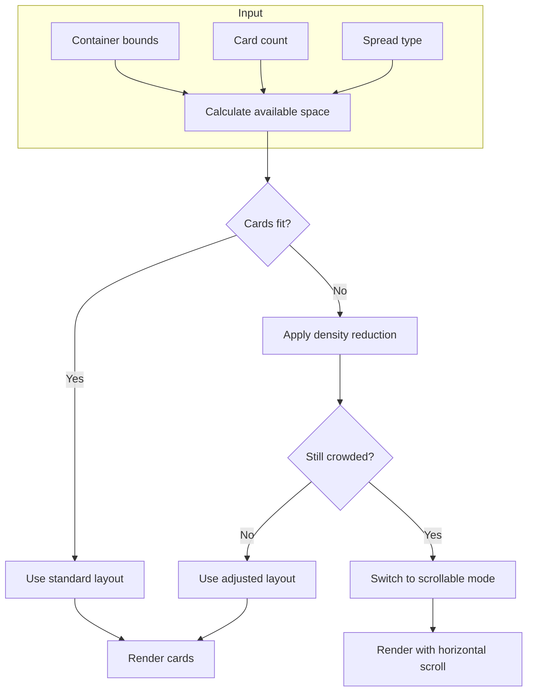
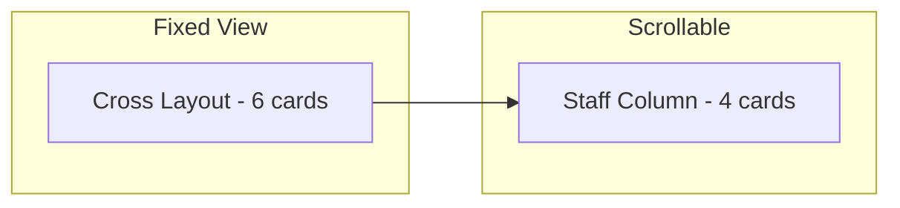

# Celtic Cross Layout Improvements Plan

## Executive Summary

The Celtic Cross spread layout on mobile devices exhibits several critical UX issues:
1. **Severe card overlap** in the center (nucleus) and right column (staff)
2. **Legend obscuring cards** at the bottom
3. **Non-responsive percentage-based positioning** that doesn't account for actual card dimensions
4. **Poor aspect ratio** for portrait mobile viewports

This document outlines architectural recommendations to resolve these issues while preserving the existing design system.

---

## Current State Analysis

### Screenshot Issues Identified

From the provided Board.png screenshot (iPhone display):

1. **Center Nucleus Overlap**: The Present (position 1) and Challenge (position 2, rotated) cards severely overlap
2. **Right Staff Column Crowding**: Positions 7-10 (Self/Advice, External, Hopes/Fears, Outcome) are packed too tightly
3. **Label Clipping**: Position labels like "Consc..." and "Out..." are truncated
4. **Legend Overlap**: The position legend at bottom overlaps with cards

### Code Architecture Issues

#### 1. Fixed Percentage Positioning
```javascript
// Current layout - percentages don't account for card size
SPREAD_LAYOUTS.celtic = [
  { x: 35, y: 50, label: 'Present' },
  { x: 35, y: 50, label: 'Challenge', rotate: 90, offsetX: 3 }, // Same position!
  // ...
];
```

**Problem**: Cards at (35%, 50%) and (35%, 50% + offsetX) will always overlap because the offset is calculated as a percentage, not relative to card width.

#### 2. Aspect Ratio Mismatch
```javascript
const aspectRatio = spreadKey === 'celtic' ? '4/3' : '3/2';
```

**Problem**: 4:3 is a landscape-oriented ratio. On portrait mobile (~393×852px viewport), this creates a container roughly 393×295px - too short for 10 cards.

#### 3. Card Sizing Doesn't Prevent Overlap
```javascript
const sizeClass = size === 'large'
  ? 'w-20 h-[120px] xs:w-24 xs:h-[140px] sm:w-28 sm:h-[160px] md:w-32 md:h-[180px]'
  : ...;
```

**Problem**: These fixed Tailwind classes produce cards ~96px wide × 140px tall on xs screens. With the Celtic Cross right column spanning 20% to 80% Y (60% of container height = ~177px), 4 cards × 140px = 560px won't fit.

---

## Architectural Recommendations

### Option A: Adaptive Layout Algorithm (Recommended)

Introduce a layout calculation pass that considers actual rendered card dimensions.



#### Implementation Steps

1. **Measure-before-render pass**:
   ```javascript
   const calculateCelticLayout = (containerWidth, containerHeight, cardWidth, cardHeight) => {
     // Calculate minimum spacing based on actual card size
     const minHorizontalGap = cardWidth * 0.15; // 15% of card width
     const minVerticalGap = cardHeight * 0.1;   // 10% of card height
     
     // Calculate positions that guarantee no overlap
     return computeNonOverlappingPositions(
       containerWidth, containerHeight,
       cardWidth, cardHeight,
       minHorizontalGap, minVerticalGap
     );
   };
   ```

2. **Adaptive aspect ratio**:
   ```javascript
   // For Celtic Cross on narrow screens, use portrait-friendly ratio
   const getCelticAspectRatio = (containerWidth) => {
     if (containerWidth < 400) return '3/4';  // Portrait
     if (containerWidth < 768) return '1/1';  // Square
     return '4/3';  // Landscape (desktop)
   };
   ```

3. **Collision detection**:
   ```javascript
   const detectOverlap = (positions, cardWidth, cardHeight) => {
     for (let i = 0; i < positions.length; i++) {
       for (let j = i + 1; j < positions.length; j++) {
         const dx = Math.abs(positions[i].x - positions[j].x);
         const dy = Math.abs(positions[i].y - positions[j].y);
         if (dx < cardWidth && dy < cardHeight) {
           return { overlapping: true, pair: [i, j] };
         }
       }
     }
     return { overlapping: false };
   };
   ```

### Option B: Breakpoint-Specific Layouts

Define completely different Celtic Cross layouts for mobile vs. tablet vs. desktop.

```javascript
const CELTIC_LAYOUTS = {
  mobile: {
    // Two-row layout for portrait phones
    aspectRatio: '2/3',
    positions: [
      // Row 1: Cross (5 cards)
      { x: 50, y: 18, label: 'Conscious' },
      { x: 25, y: 35, label: 'Past' },
      { x: 50, y: 35, label: 'Present' },
      { x: 50, y: 35, label: 'Challenge', rotate: 90, offsetY: -12 },
      { x: 75, y: 35, label: 'Near Future' },
      { x: 50, y: 52, label: 'Subconscious' },
      // Row 2: Staff (4 cards, horizontal)
      { x: 15, y: 78, label: 'Self/Advice' },
      { x: 38, y: 78, label: 'External' },
      { x: 62, y: 78, label: 'Hopes/Fears' },
      { x: 85, y: 78, label: 'Outcome' }
    ]
  },
  tablet: {
    aspectRatio: '4/3',
    positions: [/* Traditional layout with more space */]
  },
  desktop: {
    aspectRatio: '16/10',
    positions: [/* Full spread with generous spacing */]
  }
};
```

### Option C: Scrollable Staff Column

Keep the cross in view, make the staff column scrollable.



---

## Detailed Fix: Challenge Card Offset

The challenge card (position 2) currently overlaps with Present because:

```javascript
// Current: offsetX is a percentage added to x position
{ x: 35, y: 50, label: 'Challenge', rotate: 90, offsetX: 3 }

// The offset calculation:
marginLeft: pos.offsetX ? `${pos.offsetX}%` : 0
```

3% of container width (~393px) = ~12px offset, but the rotated card is ~140px wide (now tall due to rotation). The card's center is offset 12px, leaving ~70px overlapping.

### Fix: Calculate offset based on card dimensions

```javascript
// In SpreadTable.jsx, modify resolvedLayout calculation:
const resolvedLayout = useMemo(() => {
  if (spreadKey !== 'celtic') return baseLayout;
  
  const cardWidthPx = maxCardWidth || 100;
  const cardHeightPx = cardWidthPx / CARD_ASPECT;
  
  return baseLayout.map((pos, i) => {
    if (pos.label !== 'Challenge') return pos;
    
    // Calculate pixel offset to place Challenge card adjacent to Present
    // When rotated 90°, the "width" becomes the original height
    const requiredOffsetPx = (cardWidthPx / 2) + (cardHeightPx / 2) + 8; // 8px gap
    const offsetPercent = (requiredOffsetPx / tableBounds.width) * 100;
    
    return { ...pos, offsetX: offsetPercent };
  });
}, [baseLayout, maxCardWidth, tableBounds, spreadKey]);
```

---

## Recommended Implementation Order

### Phase 1: Critical Overlap Fixes (High Impact, Low Risk)
1. Fix Challenge card offset calculation
2. Increase vertical spacing in right column
3. Adjust Celtic aspect ratio for mobile

### Phase 2: Legend Improvements (Medium Impact)
1. Move legend outside spread container OR
2. Make legend collapsible/expandable on mobile
3. Use smaller typography and tighter spacing

### Phase 3: Adaptive Layout System (High Impact, Medium Risk)
1. Implement container measurement hook
2. Create mobile-specific Celtic layout
3. Add density detection and auto-adjustment

### Phase 4: Polish (Low Impact)
1. Smooth transitions between layouts
2. Better truncation handling for labels
3. Accessibility improvements for screen readers

---

## Mobile Layout Mockup

```
┌─────────────────────────────────────┐
│           ⑤ Conscious               │ 18%
│                                     │
│   ③ Past    ①②Present   ④ Future   │ 35%
│             Challenge               │
│                                     │
│           ⑥ Subconscious            │ 52%
│                                     │
├─────────────────────────────────────┤
│  ⑦Self  ⑧Extern  ⑨Hopes  ⑩Outcome  │ 78%
│  /Advice         /Fears             │
└─────────────────────────────────────┘

Aspect ratio: 2:3 (portrait)
Cards scaled smaller to fit
Staff row becomes horizontal instead of vertical
```

---

## Risk Assessment

| Change | Risk | Mitigation |
|--------|------|------------|
| Challenge offset fix | Low | Pure calculation change, no UI restructure |
| Aspect ratio change | Medium | May affect other spreads; use conditional logic |
| Breakpoint layouts | Medium | Requires testing across many devices |
| Legend relocation | Low | CSS-only change |
| Adaptive algorithm | High | Complex logic; needs thorough testing |

---

## Questions for Clarification

1. **Priority**: Should we prioritize quick fixes (Phase 1-2) or invest in the adaptive system?
2. **Breaking changes**: Is changing the Celtic Cross visual layout acceptable, or must it match the traditional arrangement?
3. **Legend**: Should the legend be always visible, collapsible, or hidden by default on mobile?
4. **Card interactivity**: On mobile, is tap-to-reveal more important than seeing all cards at once?

---

## Files to Modify

| File | Changes |
|------|---------|
| `src/components/SpreadTable.jsx` | Layout calculations, aspect ratio, offset logic |
| `src/styles/tarot.css` | Legend positioning, responsive breakpoints |
| `src/data/spreads.js` | Mobile-specific position definitions (if Option B) |
| `src/components/ReadingBoard.jsx` | Container sizing, legend visibility controls |
