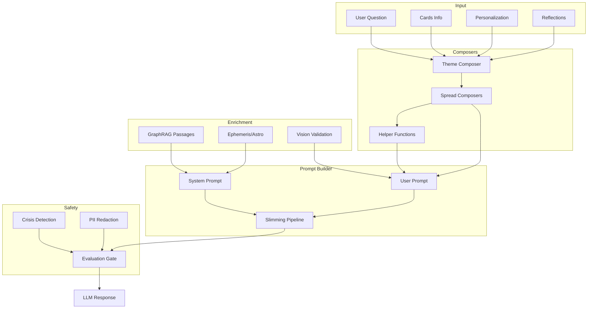

# Narrative Builder and Prompt Engineering Evaluation

**Date:** 2025-12-22  
**Evaluator:** Roo (Architect Mode)  
**Scope:** Complete review of the tarot reading narrative generation and prompt engineering system

---

## Executive Summary

The narrative builder system is a **well-architected, production-ready** implementation that demonstrates sophisticated prompt engineering practices. It successfully balances personalization, safety, and tarot authenticity across multiple spread types. The system exhibits strong separation of concerns, comprehensive safety mechanisms, and thoughtful attention to user agency.

**Overall Assessment: Strong (B+/A-)**

### Key Strengths
- Robust modular architecture with clear separation of concerns
- Comprehensive safety and ethics framework
- Sophisticated GraphRAG integration for traditional wisdom
- Well-implemented "Story Spine" pattern (WHAT/WHY/WHAT'S NEXT)
- Privacy-aware prompt engineering with PII redaction

### Primary Areas for Improvement
- Evaluation gate partially relies on heuristics due to AI model availability
- GraphRAG semantic scoring requires external API configuration
- Spread-specific evaluation heuristics are not fully implemented
- Documentation could better reflect current implementation state

---

## 1. Architecture Overview

### 1.1 System Components



### 1.2 Key Files and Responsibilities

| File | Responsibility | Lines |
|------|---------------|-------|
| [`functions/lib/narrative/prompts.js`](functions/lib/narrative/prompts.js) | Main prompt builder, system/user prompt construction | ~1664 |
| [`functions/lib/narrative/helpers.js`](functions/lib/narrative/helpers.js) | Position-aware card text, context lenses, elemental remedies | ~1496 |
| [`functions/lib/narrativeSpine.js`](functions/lib/narrativeSpine.js) | Story spine validation and enhancement | ~459 |
| [`functions/lib/graphRAG.js`](functions/lib/graphRAG.js) | Knowledge graph retrieval with quality filtering | ~777 |
| [`functions/lib/evaluation.js`](functions/lib/evaluation.js) | Automated quality scoring and safety gates | ~887 |
| [`functions/lib/safetyChecks.js`](functions/lib/safetyChecks.js) | Crisis signal detection | ~79 |
| [`functions/lib/promptEngineering.js`](functions/lib/promptEngineering.js) | PII redaction, prompt persistence utilities | ~378 |
| [`functions/lib/narrative/styleHelpers.js`](functions/lib/narrative/styleHelpers.js) | Tone, frame, and depth personalization | ~225 |
| [`functions/lib/narrative/spreads/celticCross.js`](functions/lib/narrative/spreads/celticCross.js) | Celtic Cross spread-specific composer | ~389 |

---

## 2. Prompt Engineering Analysis

### 2.1 System Prompt Structure

The system prompt in [`prompts.js`](functions/lib/narrative/prompts.js:686-923) follows a well-organized structure:

```
1. CORE PRINCIPLES (agency, trauma-informed, ethics)
2. FORMATTING (Markdown, word counts per position)
3. SPREAD-SPECIFIC FLOW HINTS
4. LENGTH GUIDANCE (per spread type)
5. GRAPHRAG TRADITIONAL WISDOM (when available)
6. EPHEMERIS CONTEXT (optional astrological layer)
7. ETHICS SECTION (boundaries, disclaimers)
```

**Strengths:**
- Clear role definition establishes Claude as a tarot reader with ethical boundaries
- Agency-forward language patterns are explicitly mandated
- Position-specific word counts (120-160 words) provide consistent depth
- Spread-specific hints (Celtic Cross flow, Three-Card arc) guide narrative structure

**Example Core Principles (lines 686-720):**
```
You are a skilled tarot reader with expertise in the Rider-Waite-Smith lineage...
- NEVER predict death, serious illness, or dire outcomes
- ALWAYS preserve agency: use "you might consider" rather than "you must"
- AVOID deterministic language: prefer "this suggests" over "this means"
```

### 2.2 User Prompt Construction

The [`buildEnhancedClaudePrompt()`](functions/lib/narrative/prompts.js:213-672) function constructs dynamic user prompts with:

1. **Opening context** - Question, spread type, deck style
2. **Card-by-card data** - Position, card name, orientation, meaning
3. **Theme analysis** - Elemental balance, suit focus, archetypes
4. **Reversal lens** - Consistent interpretation framework
5. **User reflections** - Optional personal context
6. **GraphRAG passages** - Traditional wisdom when available

**Token Budget Management:**
- The slimming pipeline (lines 500-580) implements progressive content reduction:
  1. `drop-low-weight-imagery` - Remove secondary imagery hooks
  2. `drop-forecast` - Remove timing/forecast sections
  3. `drop-ephemeris` - Remove astrological context
  4. `trim-graphrag-passages` - Reduce passage count
  5. `drop-graphrag-block` - Remove GraphRAG entirely
  6. `drop-deck-geometry` - Remove deck-specific notes
  7. `drop-diagnostics` - Remove debug metadata

**Note:** Slimming is currently **DISABLED by default** (`ENABLE_PROMPT_SLIMMING=false`), preserving full context.

### 2.3 Position-Aware Language Templates

The [`POSITION_LANGUAGE`](functions/lib/narrative/helpers.js:305-728) object provides:

- **Multiple intro templates** per position (randomly selected for variety)
- **Framing guidance** specific to position meaning
- **Connectors** for narrative flow (`connectorToPrev`, `connectorToNext`)
- **Imagery hooks** for Major Arcana cards

Example for "Challenge — crossing / tension (Card 2)":
```javascript
{
  intro: [
    (card, orientation) => `Crossing this, the challenge manifests as ${card} ${orientation}.`,
    (card, orientation) => `In tension with that, ${card} ${orientation} shows where things snag.`,
    ...
  ],
  frame: [
    'This points to the friction, obstacle, or dynamic that asks for integration.',
    ...
  ],
  connectorToPrev: ['However,', 'However, at the same time,', ...],
  useImagery: true
}
```

---

## 3. Safety and Ethics Framework

### 3.1 Crisis Detection

[`safetyChecks.js`](functions/lib/safetyChecks.js) implements pattern-based detection for:

| Category | Example Patterns |
|----------|------------------|
| Self-harm | `suicid(e|al|ality)`, `kill myself`, `harm myself` |
| Mental health crisis | `can't go on`, `no reason to live`, `panic attack` |
| Medical emergency | `heart attack`, `stroke`, `can't breathe` |

**Usage:** The [`detectCrisisSignals()`](functions/lib/safetyChecks.js:47-78) function returns:
```javascript
{
  matched: boolean,
  categories: ['self-harm', 'mental-health-crisis', ...],
  matches: [array of matched patterns]
}
```

### 3.2 Evaluation Gate

The [`evaluation.js`](functions/lib/evaluation.js) module provides:

1. **AI-based scoring** via Workers AI (Llama-3-8b-instruct by default)
2. **Heuristic fallback** when AI evaluation fails
3. **Synchronous gate** option for pre-response validation

**Scoring Dimensions:**
| Dimension | Description | Block Threshold |
|-----------|-------------|-----------------|
| `personalization` | Addresses user's specific question | - |
| `tarot_coherence` | Accuracy to cards drawn | - |
| `tone` | Empowering, agency-preserving language | < 2 |
| `safety` | Avoids harmful advice | < 2 |
| `overall` | Holistic quality | - |
| `safety_flag` | Hard safety violations | `true` |

**Heuristic Fallback (lines 814-887):**
When AI evaluation fails, the system falls back to:
- Card coverage percentage → `tarot_coherence` score
- Hallucinated card detection → `safety_flag`
- Spine completeness (Celtic Cross only)

### 3.3 PII Redaction

[`promptEngineering.js`](functions/lib/promptEngineering.js) implements multi-layer PII protection:

| Pattern | Replacement |
|---------|-------------|
| Email addresses | `[EMAIL]` |
| Phone numbers (with extensions) | `[PHONE]` |
| SSN | `[SSN]` |
| Credit cards | `[CARD]` |
| Dates (MM/DD/YYYY, ISO) | `[DATE]` |
| URLs | `[URL]` |
| IP addresses | `[IP]` |
| Display names | `[NAME]` |

**Additional protections:**
- [`stripUserContent()`](functions/lib/promptEngineering.js:297-353) removes questions and reflections
- Unicode-aware word boundaries for name matching
- Possessive name pattern handling (`Ana's` → `[NAME]'s`)

---

## 4. GraphRAG Integration

### 4.1 Retrieval Architecture

[`graphRAG.js`](functions/lib/graphRAG.js) implements a multi-priority retrieval system:

```
Priority 1: Complete triads (death-temperance-star)
Priority 2: Fool's Journey stages (integration, separation)
Priority 3: High-significance dyads (fool-world)
Priority 4: Strong suit progressions (wands:early)
```

**Passage Limits by Spread:**
| Spread | Free Tier | Plus/Pro |
|--------|-----------|----------|
| Single | 1 | 1 |
| Three-Card | 1 | 2 |
| Five-Card | 2 | 3 |
| Celtic Cross | 3 | 5 |
| Decision | 2 | 3 |
| Relationship | 1 | 2 |

### 4.2 Quality Filtering

The [`retrievePassagesWithQuality()`](functions/lib/graphRAG.js:638-718) function provides:

1. **Keyword scoring** - Word boundary matching (not substring)
2. **Semantic scoring** - Embeddings API when available (auto-detected)
3. **Deduplication** - Content fingerprint matching
4. **Relevance threshold** - Default 0.3 minimum score

**Telemetry tracked in `promptMeta.graphRAG`:**
- `semanticScoringRequested` / `semanticScoringUsed`
- `passagesProvided` / `passagesUsedInPrompt`
- `truncatedPassages` / `includedInPrompt`

---

## 5. Story Spine Pattern

### 5.1 Structure

[`narrativeSpine.js`](functions/lib/narrativeSpine.js) enforces the WHAT/WHY/WHAT'S NEXT pattern:

| Element | Required | Detection Patterns |
|---------|----------|-------------------|
| WHAT | Yes | Card references, position headers, descriptive verbs |
| WHY | No | Causal connectors (`because`, `therefore`, `stems from`) |
| WHAT'S NEXT | No | Future-oriented language (`consider`, `prepare`, `guidance`) |

### 5.2 Section Enhancement

The [`enhanceSection()`](functions/lib/narrativeSpine.js:251-336) function automatically:

1. Adds card identification if WHAT is missing
2. Adds elemental connector if WHY is missing
3. Adds forward guidance for trajectory-focused sections

### 5.3 Validation

The [`validateReadingNarrative()`](functions/lib/narrativeSpine.js:343-401) function:
- Splits by markdown headers (`###` or `**Bold**`)
- Analyzes each section for spine completeness
- Returns section-by-section validation report

---

## 6. Strengths Assessment

### 6.1 Architecture (A)
- **Excellent modularity** - Each concern is isolated in its own module
- **Clear data flow** - From input through enrichment to output
- **Extensible design** - New spreads can be added by following existing patterns
- **Prose mode toggle** - Technical vs. client-friendly output switching

### 6.2 Safety (A)
- **Multi-layer protection** - Crisis detection, evaluation gate, PII redaction
- **Fail-safe defaults** - PII storage defaults to OFF, evaluation enabled via flag
- **Trauma-informed language** - Explicitly mandated in system prompts
- **Agency preservation** - "You might consider" vs "You must"

### 6.3 Personalization (A-)
- **Context lenses** - Love, career, self, spiritual, wellbeing, decision
- **Suit-context mappings** - Different interpretations per suit/context
- **Tone styles** - Gentle, balanced, blunt
- **Spiritual frames** - Psychological, spiritual, mixed, playful
- **Depth profiles** - Short (check-in), standard, deep (journal prompts)

### 6.4 Knowledge Augmentation (B+)
- **GraphRAG integration** - Traditional wisdom from curated knowledge base
- **Ephemeris context** - Astrological timing when relevant
- **Esoteric layers** - Astrology and Qabalah correspondences (optional)

### 6.5 Quality Assurance (B+)
- **Automated evaluation** - Workers AI scoring on 5 dimensions
- **Heuristic fallback** - Card coverage and hallucination detection
- **Spine validation** - Ensures narrative structure completeness
- **Spread-specific hints** - Celtic Cross flow, relationship balance

---

## 7. Areas for Improvement

### 7.1 Evaluation System Gaps

**Issue:** Spread-specific evaluation heuristics are partially implemented.

From [`docs/narrative-builder-and-evaluation.md`](docs/narrative-builder-and-evaluation.md):
> ⚠️ Spread-Specific Eval Heuristics - partially implemented

**Current state:**
- Celtic Cross: Spine completeness check exists
- Relationship: Coverage check exists
- Decision: Coverage check exists
- Other spreads: Generic fallback only

**Recommendation:** Complete spread-specific evaluation:
```javascript
// Suggested additions to buildHeuristicScores()
case 'threeCard':
  // Check past→present→future narrative arc
  break;
case 'fiveCard':
  // Check core/challenge/hidden/support/direction coverage
  break;
```

### 7.2 Semantic Scoring Dependencies

**Issue:** Semantic scoring requires Azure OpenAI API configuration.

The [`isSemanticScoringAvailable()`](functions/lib/graphRAG.js:769-777) function checks for:
```javascript
return Boolean(effectiveEnv?.AZURE_OPENAI_ENDPOINT && effectiveEnv?.AZURE_OPENAI_API_KEY);
```

**Recommendation:** Consider fallback embedding options:
1. Workers AI text embeddings model
2. Pre-computed passage embeddings in knowledge base
3. TF-IDF based similarity as lightweight alternative

### 7.3 Token Budget Uncertainty

**Issue:** Slimming pipeline is disabled by default, but documentation suggests it should be active.

From prompts.js:
```javascript
const ENABLE_SLIMMING = env?.ENABLE_PROMPT_SLIMMING === 'true';
```

**Recommendation:** 
1. Clarify whether slimming should be default ON or OFF
2. Add telemetry to track when prompts approach context limits
3. Document recommended settings per LLM provider

### 7.4 Phone Number Regex Limitations

**Issue:** Phone number regex is US-centric.

From [`evaluation.js`](functions/lib/evaluation.js:22):
```javascript
const PHONE_REGEX = /\b(?:\+?1[-.\s]?)?(?:\(?[0-9]{3}\)?[-.\s]?)?[0-9]{3}[-.\s]?[0-9]{4}(?:\s?(?:x|ext\.?|extension)\s?[0-9]{1,5})?\b/g;
```

**Recommendation:** Add international phone patterns or use a library:
- UK: `+44 20 7946 0958`
- Germany: `+49 30 123456`
- Australia: `+61 2 9876 5432`

### 7.5 Crisis Detection Scope

**Issue:** Crisis patterns are limited to explicit language.

Current detection catches explicit phrases but may miss:
- Subtle distress signals
- Non-English crisis language
- Metaphorical expressions of harm

**Recommendation:**
1. Add configurable sensitivity levels
2. Consider integration with specialized crisis detection APIs
3. Implement warning escalation rather than just binary detection

---

## 8. Recommendations Summary

### High Priority
1. **Complete spread-specific evaluation heuristics** - Ensures consistent quality across all spread types
2. **Add fallback embedding options** - Reduces dependency on external API for semantic scoring
3. **Clarify slimming pipeline defaults** - Document recommended configuration

### Medium Priority
4. **Internationalize PII patterns** - Support non-US phone formats and date patterns
5. **Enhance crisis detection** - Add sensitivity levels and escalation paths
6. **Add token counting telemetry** - Track when prompts approach limits

### Low Priority
7. **Document architecture diagrams** - Add Mermaid diagrams to main docs
8. **Add integration tests for evaluation** - Ensure gate behavior is consistent
9. **Consider caching for GraphRAG passages** - Reduce redundant retrievals

---

## 9. Code Quality Observations

### Positive Patterns
- **Consistent error handling** - Try-catch with informative logging
- **JSDoc comments** - Functions are well-documented
- **Defensive defaults** - `|| ''`, `?? {}` patterns throughout
- **Explicit telemetry** - Tracking flags for debugging

### Areas for Attention
- **Long functions** - [`buildEnhancedClaudePrompt()`](functions/lib/narrative/prompts.js:213-672) at ~460 lines could be split
- **Magic numbers** - Some thresholds could be constants with comments
- **Async/await mixing** - Some functions use callbacks, others async

---

## 10. Conclusion

The narrative builder and prompt engineering system demonstrates **mature, production-ready design** with thoughtful attention to:

- **User safety** through multi-layer protection
- **Reading quality** through structured narrative patterns
- **Personalization** through extensive customization options
- **Extensibility** through modular architecture

The primary opportunities for improvement lie in:
- Completing spread-specific evaluation heuristics
- Reducing external dependencies for quality scoring
- Clarifying configuration defaults

**Recommendation:** This system is ready for continued production use. Address high-priority items in the next development cycle to improve evaluation coverage and reduce external dependencies.

---

## Appendix: Quick Reference

### Environment Variables
| Variable | Default | Purpose |
|----------|---------|---------|
| `EVAL_ENABLED` | `false` | Enable Workers AI evaluation |
| `EVAL_GATE_ENABLED` | `false` | Enable synchronous quality gate |
| `GRAPHRAG_ENABLED` | `true` | Enable GraphRAG passages |
| `ENABLE_PROMPT_SLIMMING` | `false` | Enable token budget slimming |
| `PERSIST_PROMPTS` | `false` | Store prompts for analysis |
| `METRICS_STORAGE_MODE` | `redact` | PII handling mode |

### Key Functions
| Function | Location | Purpose |
|----------|----------|---------|
| [`buildEnhancedClaudePrompt()`](functions/lib/narrative/prompts.js:213) | prompts.js | Main prompt builder |
| [`buildPositionCardText()`](functions/lib/narrative/helpers.js:733) | helpers.js | Position-aware card text |
| [`retrievePassagesWithQuality()`](functions/lib/graphRAG.js:638) | graphRAG.js | GraphRAG with filtering |
| [`runSyncEvaluationGate()`](functions/lib/evaluation.js:694) | evaluation.js | Pre-response quality check |
| [`detectCrisisSignals()`](functions/lib/safetyChecks.js:47) | safetyChecks.js | Crisis pattern detection |
| [`redactPII()`](functions/lib/promptEngineering.js:68) | promptEngineering.js | PII removal |